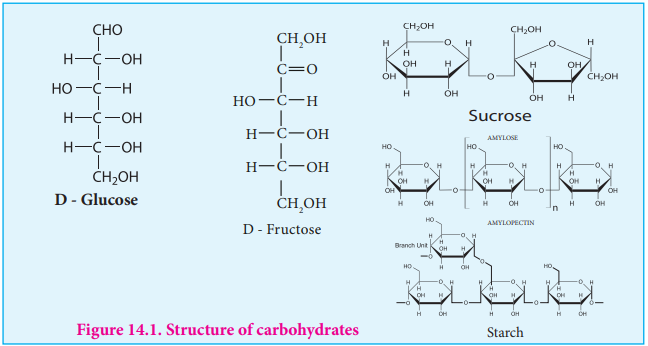
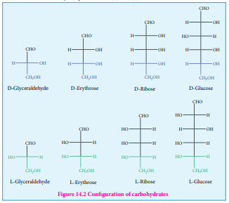
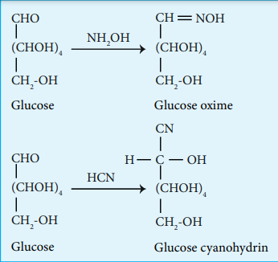
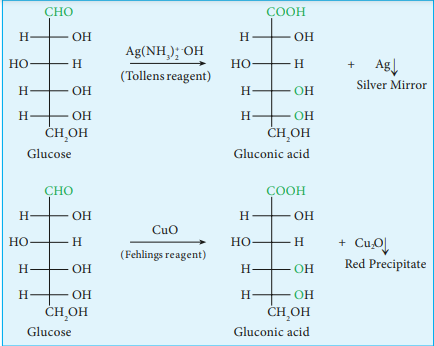
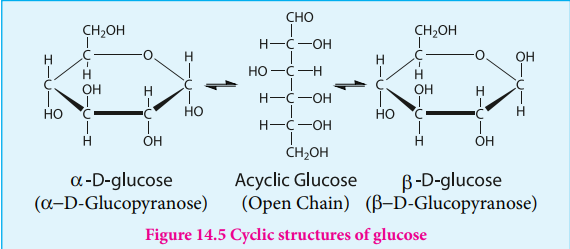
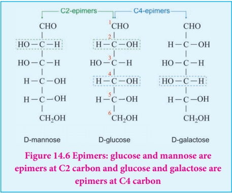
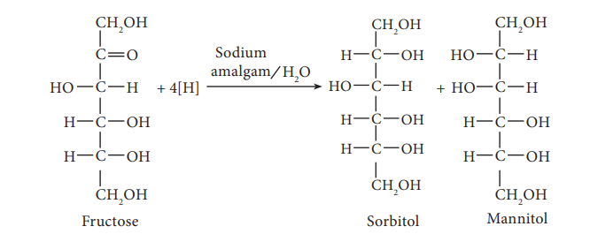
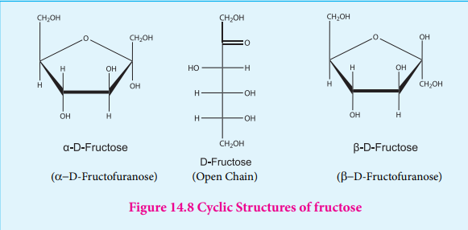
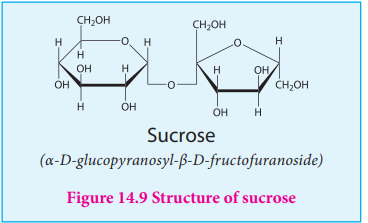
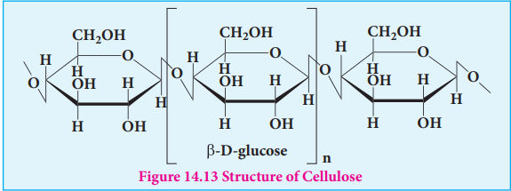

## Carbohydrates:
 Carbohydrates are the most abundant organic compounds in every living organism. They

are also known as saccharides (derived from Greek word ‘_sakcharon_’ which means sugar) as many of them are sweet. They are considered as hydrates of carbon, containing hydrogen and oxygen in the same ratio as in water. Chemically, they are defined as polyhydroxy aldehydes or ketones with a general formula Cn(H2O)n. Some common examples are glucose (monosaccharide), sucrose (disaccharide) and starch (polysaccharide)

Carbohydrates are synthesised by green leaves during photo synthesis, a complex process in which sun light provides the energy to convert carbon dioxide and water into glucose and oxygen. Glucose is then converted into other carbohydrates and is consumed by animals.

### Configuration of carbohydrates:

Almost all carbohydrates are optically active as they have one or more chiral carbons. The number of optical isomers depends on the number of chiral carbons (2n isomers, where n is the total number of chiral carbons). We have already learnt in XI standard to represent an organic compound using Fischer projection formula. Fischer has devised a projection formula to relate the structure of a carbohydrate to one of the two enantiomeric forms of glyceraldehyde (Figure 14.2). Based on these structures, carbohydrates are named as D or L.The carbohydrates are usually named with two prefixes namely D or L and followed by sign either (+) or (-). Carbohydrates are assigned the notation (D/L) by comparing the configuration of the carbon that is attached to -CH2OH group with that of glyceraldehyde.For example D-glucose is so named because the H and OH on C5 carbon are in the same configuration as the H and OH on C2 carbon in D-Glyceraldehyde.

There + and – sign indicates the dextro rotatory and levo rotatory respectively. Dextro rotatory compounds rotate the plane of plane polarised light in clockwise direction while the levo rotatory compounds rotate in anticlockwise direction. The D or L isomers can either be dextro or levo rotatory compounds. Dextro rotatory compounds are represented as D-(+) or L-(+) and the levo rotatory compounds as D-(–) or L-(–)

### Classification of carbohydrates:
 Carbohydrates can be classified into three major groups based on their product of

hydrolysis, namely monosaccharides, oligosaccharides and polysaccharides.

**Monosaccharides:**Monosaccharides are carbohydrates that cannot be hydrolysed further and are also called simple sugars. Monosaccharides have general formula Cn(H2O)n. While there are many monosaccharides known only about 20 of them occur in nature. Some common examples are glucose, fructose, ribose, erythrose

Monosaccharides are further classified based on the functional group present (aldoses or ketoses) and the number of carbon present in the chain (trioses, tetroses, pentoses, hexoses etc...). If the carbonyl group is an aldehyde, the sugar is an aldose. If the carbonyl group is a ketone, the sugar is a ketose. The most common monosaccharides have three to eight carbon atoms.

**Table 14.1 Different types of monosaccharides:**
| No. of carbon atoms in the chain |Functional group present |Type of sugar |Example |
|------|------|------|------|
| 3 |Aldehyde |Aldotriose |Glyceraldehyde |
| 3 |Ketone |Ketotriose |Dihydroxy acetone |
| 4 |Aldehyde |Aldotetrose |Er ythrose |
| 4 |Ketone |Ketotetrose |Er ythrulose |
| 5 |Aldehyde |Aldopentose |Ribose |
| 5 |Ketone |Ketopentose |Ribulose |
| 6 |Aldehyde |Aldohexose |Glucose |
| 6 |Ketone |Ketohexose |Fructose |

**No. of carbon atoms in the chain**

**Functional group present Type of sugar Example**

3 Aldehyde Aldotriose Glyceraldehyde 3 Ketone Ketotriose Dihydroxy acetone 4 Aldehyde Aldotetrose Erythrose 4 Ketone Ketotetrose Erythrulose 5 Aldehyde Aldopentose Ribose 5 Ketone Ketopentose Ribulose 6 Aldehyde Aldohexose Glucose 6 Ketone Ketohexose Fructose

### Glucose
 Glucose is a simple sugar

which serves as a major energy source for us. It is the most important and most abundant sugar. It is present in honey, sweet fruits such as grapes and mangoes etc... Human blood contains about 100 mg/ dL of glucose, hence it is also known as blood sugar. In the combined form it is present in sucrose, starch, cellulose etc.,

**Preparation of glucose**

1\. When sucrose (_cane sugar_) is boiled with dilute H SO 2 4

in alcoholic solution, it undergoes hydrolysis and give glucose and fructose.

2\. Glucose is produced commercially by the hydrolysis of starch with dilute HCl at high temperature under pressure.

**Structure of Glucose**

Glucose is an aldohexose. It is optically active with four asymmetric carbons. Its solution is dextrorotatory and hence it is also called as dextrose. The proposed structure of glucose is shown in the figure 14.4 which was derived based on the following evidences.

-glucose.png)

1\. Elemental analysis and molecular weight determination show that the molecular formula of glucose is C6H12O6

2\. On reduction with concentrated HI and red phosphorus at 373K, glucose gives a mixture of n hexane and 2–iodohexane indicating that the six carbon atoms are bonded linearly.

3\. Glucose reacts with hydroxylamine to form oxime and with HCN to form cyanohydrin. These reactions indicate the presence of carbonyl group in glucose.

4\. Glucose gets oxidized to gluconic acid with mild oxidizing agents like bromine water suggesting that the carbonyl group is an aldehyde group and it occupies one end of the carbon chain. When oxidised using strong oxidising agent such as conc. nitric acid gives glucaric acid (saccharic acid) suggesting the other end is occupied by a primary alcohol group.

5\. Glucose is oxidised to gluconic acid with ammonical silver nitrate (Tollen’s reagent) and alkaline copper sulphate (Fehling’s solution). Tollen’s reagent is reduced to metallic silver and Fehling’s solution to cuprous oxide which appears as red precipitate. These reactions further confirm the presence of an aldehyde group

6\. Glucose forms penta acetate with acetic anhydride suggesting the presence of five alcohol groups.

7\. Glucose is a stable compound and does not undergo dehydration easily. It indicates that not more than one hydroxyl group is bonded to a single carbon atom. Thus the five the hydroxyl groups are attached to five different carbon atoms and the sixth carbon is an aldehyde group.

8\. The exact spacial arrangement of -OH groups was given by Emil Fischer as shown in Figure 14.4. The glucose is referred to as D(+) glucose as it has D configuration and is dextrorotatory.

**Cyclic structure of glucose** Fischer identified that the open chain penta hydroxyl aldehyde structure of glucose, that he proposed, did not completely explain its chemical behaviour. Unlike simple aldehydes, glucose did not form crystalline bisulphite compound with sodium bisulphite. Glucose does not give Schiff ’s test and the penta acetate derivative of glucose was not oxidized by Tollen’s reagent or Fehling’s solution. This behaviour could not be explained by the open chain structure.

In addition, glucose is found to crystallise in two different forms depending upon the crystallisation conditions with different melting points (419 and 423 K). In order to explain these it was proposed that one of the hydroxyl group reacts with the aldehyde group to form a cyclic structure (hemiacetal form) as shown in figure 14.5. This also results in the conversion of the achiral aldehyde carbon into a chiral one leading to the possibility of two isomers. These two isomers differ only in the configuration of C1 carbon. These isomers are called **anomers. The two anomeric forms of glucose are called a and β-forms. This cyclic structure** of glucose is similar to pyran, a cyclic compound with 5 carbon and one oxygen atom, and hence is called pyranose form. The specific rotation of pure a- and β-(D) glucose are 112º & 18.7º respectively. However, when a pure form of any one of these sugars is dissolved in water, slow interconversion of α-D glucose and β-D glucose via open chain form occurs until equilibrium is established giving a constant specifi c rotation + 53º. Th is phenomenon is called **mutarotation**.

**Epimers and epimerisation:**

Sugar diff ering in confi guration at an asymmetric centre is known as epimers. Th e process by which one epimer is converted into other is called epimerisation and it requires the enzymes epimerase. Galactose is converted to glucose by this manner in our body.

### Fructose

Fructose is another commonly known monosaccharide having the same molecular formula as glucose. It is levorotatory and a ketohexose. It is present abundantly in fruits and hence it is also called as fruit sugar.

** Preparation ** 
**1.From sucrose**

Fructose is obtained from sucrose by heating with dilute H2SO4 or with the enzyme invertase

Fructose is separated by crystallisation. Th e mixture having equal amount of glucose and fructose is termed as invert sugar. 

**2\. From Inulin**

Fructose is prepared commercially by hydrolysis of Inulin (a polysaccharide) in an acidic medium.

**Structure of fructose:** Fructose is the sweetest of all known sugars. It is readily soluble in water. Fresh solution of

fructose has a specific rotation -1330 which changes to – 920 at equilibrium due to mutarotation. Similar to glucose the structure of fructose is deduced from the following facts.

1\. Elemental analysis and molecular weight determination of fructose show that it has the molecular formula C6H2O6

2\. Fructose on reduction with HI and red phosphorus gives a mixture of n – hexane (major product) and 2 – iodohexane (minor product). This reaction indicates that the six carbon atoms in fructose are in a straight chain.

3\. Fructose reacts with NH OH 2 and HCN . It shows the presence of a carbonyl groups in the fructose.

4\. Fructose reacts with acetic anhydride in the presence of pyridine to form penta acetate. This reaction indicates the presence of five hydroxyl groups in a fructose molecule.

5\. Fructose is not oxidized by bromine water. This rules out the possibility of absence of an aldehyde (-CHO) group.

6\. Partial reduction of fructose with sodium amalgam and water produces mixtures of sorbitol and mannitol which are epimers at the second carbon. New asymmetric carbon is formed at C-2. This confirms the presence of a keto group.

7\. On oxidation with nitric acid, it gives glycollic acid and tartaric acids which contain smaller number of carbon atoms than in fructose.

This shows that a keto group is present in C-2. It also shows that 1O alcoholic groups are present at C- 1 and C- 6. Based on these evidences, the following structure is proposed for fructose (Figure 14-7)

-fructose.png)

**Cyclic structure of fructose**

Like glucose, fructose also forms cyclic structure. Unlike glucose it forms a five membered ring similar to furan. Hence it is called furanose form. When fructose is a component of a saccharide as in sucrose, it usually occurs in furanose form.

### Disaccharides
 Disaccharides are sugars that yield two molecules of monosaccharides on hydrolysis. This

reaction is usually catalysed by dilute acid or enzyme. Disaccharides have general formula Cn(H2O)n-1.In disaccharides two monosaccharide’s are linked by _oxide linkage_ called ‘_glycosidic linkage_’, which is formed by the reaction of the anomeric carbon of one monosaccharide reacts with a hydroxyl group of another monosaccharide. Example: Sucrose, Lactose, Maltose

**Sucrose:** Sucrose, commonly known as table sugar is the most abundant disaccharide. It is obtained mainly from the juice of sugar cane and sugar beets. Insects such as honey bees have the enzyme called invertases that catalyzes the hydrolysis of sucrose to a glucose and fructose mixture. Honey in fact, is primarily a mixture of glucose, fructose and sucrose. On hydrolysis sucrose yields equal amount of glucose and fructose units.
         
         
         Invertase
Sucrose ------------> Glucose+Fructose

Sucrose (+66.6°) and glucose (+52.5°) are dextrorotatory compounds while fructose is levo rotatory (-92.4°). During hydrolysis of sucrose the optical rotation of the reaction mixture changes from dextro to levo. Hence, sucrose is also called as invert sugar.

**Structure:** 
In sucrose, C1 of a-D-glucose is joined to C2 of β-D-fructose. The glycosidic bond thus

formed is called a-1,2 glycosidic bond. Since, both the carbonyl carbons (reducing groups) are involved in the glycosidic bonding, sucrose is a non-reducing sugar.

**Lactose:** Lactose is a disaccharide found in milk of mammals and hence it is referred to as milk sugar. On hydrolysis, it yields galactose and glucose. Here, the β-D–galactose and β-D–glucose are linked by β-1,4 glycosidic bond as shown in the figure 14.10 . The aldehyde carbon is not involved in the glycosidic bond hence, it retains its reducing property and is called a reducing sugar.

**Maltose:** Maltose derives its name from malt from which it is extracted. It is commonly called as malt sugar. Malt from sprouting barley is the major source of maltose. Maltose is produced during digestion of starch by the enzyme a-amylase.

Maltose consists two molecules of a-D-glucose units linked by an a-1,4 glycosidic bond between anomeric carbon of one unit and C-4 of the other unit. Since one of the glucose has the carbonyl group intact, it also acts as a reducing sugar.

### Polysaccharides:

Polysaccharides consist of large number of monosaccharide units bonded together by glycosidic bonds and are the most common form of carbohydrates. Since, they do not have sweet taste polysaccharides are called as non-sugars. Th ey form linear and branched chain molecules.

Polysaccharides are classifi ed into two types, namely, homopolysaccharides and heteropolysaccharides depending upon the constituent monosaccharides. Homopolysaccharides are composed of only one type of monosaccharides while the heteropolysaccharides are composed of more than one. Example: starch, cellulose and glycogen (homopolysaccharides); hyaluronic acid and heparin (heteropolysaccharides).

**STARCH** Starch is used for energy storage in plants. Potatoes, corn, wheat and rice are the rich

sources of starch. It is a polymer of glucose in which glucose molecules are lined by a(1,4) glycosidic bonds. Starch can be separated into two fractions namely, water soluble amylose and water insoluble amylopectin. Starch contains about 20 % of amylose and about 80% of amylocpectin.

Amylose is composed of unbranched chains upto 4000 a-D-glucose molecules joined by a(1,4)glycosidic bonds. Amylopetin contains chains upto 10000 a-D-glucose molecules linked by a(1,4)glycosidic bonds. In addition, there is a branching from linear chain. At branch points, new chains of 24 to 30 glucose molecules are linked by a(1,6)glycosidic bonds. With iodine solution amylose gives blue colour while amylopectin gives a purple colour.

.png)

**Cellulose** Cellulose is the major constituent of plant cell walls. Cotton is almost pure cellulose. On hydrolysis cellulose yields D-glucose molecules. Cellulose is a straight chain polysaccharide. The glucose molecules are linked by β(1,4)glycosidic bond.

Cellulose is used extensively in the manufacturing paper, cellulose fibres, rayon explosive, (Gun cotton – Nitrated ester of cellulose) and so on. Human cannot use cellulose as food because our digestive systems do not contain the necessary enzymes (glycosidases or cellulases) that can hydrolyse the cellulose.

**Glycogen:** Glycogen is the storage polysaccharide of animals. It is present in the liver and muscles of animals. Glycogen is also called as animal starch. On hydrolysis it gives glucose molecules. Structurally, glycogen resembles amylopectin with more branching. In glycogen the branching occurs every 8-14 glucose units opposed to 24-30 units in amylopectin. The excessive glucose in the body is stored in the form of glycogen.

### Importance of carbohydrates

1\. Carbohydrates, widely distributed in plants and animals, act mainly as energy sources and structural polymers.

2\. Carbohydrate is stored in the body as glycogen and in plant as starch.

3\. Carbohydrates such as cellulose which is the primary components of plant cell wall, is used to make paper, furniture (wood) and cloths (cotton)

4\. Simple sugar glucose serves as an instant source of energy.

5\. Ribose sugars are one of the components of nucleic acids.

6\. Modified carbohydrates such as hyaluronate (glycosaminoglycans) act as shock absorber and lubricant.
