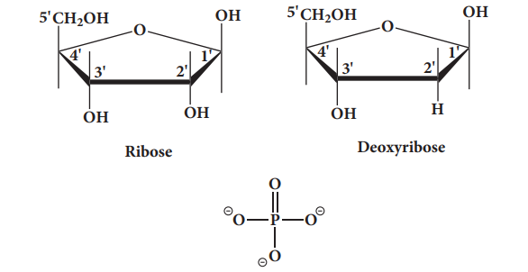
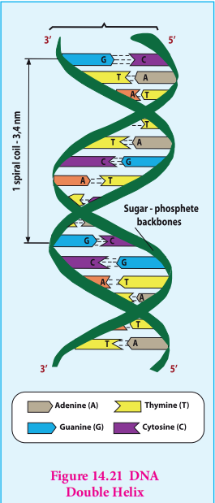
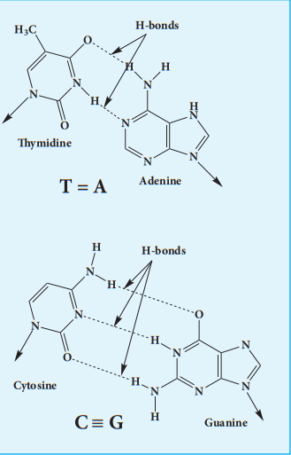
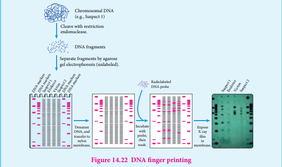
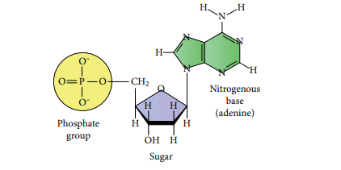
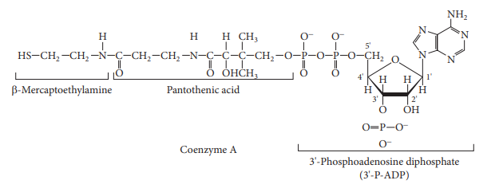
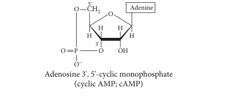

## Nucleic acids
 The inherent characteristics of each and every species are transmitted from one

generation to the next. It has been observed that the particles in nucleus of the cell are responsible for the transmission of these characteristics. They are called chromosomes and are made up of proteins and another type of biomolecules called nucleic acids. There are mainly two types nucleic acids, the deoxyribonucleic acid (DNA) and ribonucleic acid (RNA). They are the molecular repositories that carry genetic information in every organism.

### Composition and structure of nucleic acids

Nucleic acids are biopolymers of nucleotides. Controlled hydrolysis of DNA and RNA yields three components namely a nitrogenous base, a pentose sugar and phosphate group.

**Nitrogen base**

These are nitrogen containing organic compounds which are derivatives of two parent compounds, **pyrimidine** and **purine**. Both DNA and RNA have two major purine bases, **adenine** (A) and **guanine** (G). In both DNA and RNA, one of the pyrimidines is **cytosine** (C), but the second pyrimidine is **thymine** (T) in DNA and **uracil** (U) in RNA.

  
**Pentose sugar:**

Nucleic acids have two types of pentoses. Th e recurring deoxyribonucleotide units of DNA contain **2’-deoxy-D-ribose** and the ribonucleotide units of RNA contain **D-ribose**. In nucleotides, both types of pentoses are in their β-furanose (closed fi ve membered rings) form.

**Posphate group**

Phosphoric acid forms phospho diester bond between nucleotides. Based on the number of phosphate group present in the nucleotides, they are classifi ed into mono nucleotide, dinucleotide and trinucleotide.

**Nucleosides and nucleotides:**

Th e molecule without the phosphate group is called a nucleoside. A nucleotide is derived from a nucleoside by the addition of a molecule of phosphoric acid. Phosphorylation occurs generally in the 5’ OH group of the sugar. Nucleotides are linked in DNA and RNA by phospho diester bond between 5’ OH group of one nucleotide and 3’ OH group on another nucleotide.

Sugar + Base ---> Nucleoside

Nucleoside + Phosphate ---> Nucleotide

nNucleotide ---> Polynucleotide(Nucleic Acid) 

### Double strand helix structure of DNA

In early 1950s, Rosalind Franklin and Maurice Wilkins used X-ray diff raction to unravel the structure of DNA. Th e DNA fi bers produced a characteristic diff raction pattern.

Th e central X shaped pattern indicates a helix, whereas the heavy black arcs at the top and bottom of the diff raction pattern reveal the spacing of the stacked bases.

The structure elucidation of DNA by Watson and Crick in 1953 was a momentous event in science. They postulated a 3-dimensional model of DNA structure which consisted of two antiparallel helical DNA chains wound around the same axis to form a right-handed double helix.

The hydrophilic backbones of alternating deoxyribose and phosphate groups are on the outside of the double helix, facing the surrounding water. The purine and pyrimidine bases of both strands are stacked inside the double helix, with their hydrophobic and ring structures very close together and perpendicular to the long axis, thereby reducing the repulsions between the charged phosphate groups. The offset pairing of the two strands creates a major groove and minor groove on the surface of the duplex.

The model revealed that, there are 10.5 base pairs (36 Å) per turn of the helix and 3.4 Å between the stacked bases. They also found that each base is hydrogen bonded to a base in opposite strand to form a planar base pair.

Two hydrogen bonds are formed between adenine and thymine and three hydrogen bonds are formed between guanine and cytosine. Other pairing tends to destabilize the double helical structure. This specific association of the two chains of the double helix is known as complementary base pairing. The DNA double helix or duplex is held together by two forces, 
a) Hydrogen bonding between complementary base pairs 
b) Base-stacking interactions

The complementary between the DNA strands is attributable to the hydrogen bonding between base pairs but the base stacking interactions are largely non-specific, make the major contribution to the stability of the double helix. 

### Types of RNA molecules

Ribonucleic acids are similar to DNA. Cells contain up to eight times high quantity of RNA than DNA. RNA is found in large amount in the cytoplasm and a lesser amount in the nucleus. In the cytoplasm it is mainly found in ribosomes and in the nucleus, it is found in nucleolus.

RNA molecules are classified according to their structure and function into three major types

i. Ribosomal RNA (rRNA) ii. Messenger RNA (mRNA) iii. Transfer RNA (tRNA)

**rRNA** 
rRNA is mainly found in cytoplasm and in ribosomes, which contain 60% RNA and 40%
protein. Ribosomes are the sites at which protein synthesis takes place. 

**tRNA**
tRNA molecules have lowest molecular weight of all nucleic acids. They consist of 73 – 94 nucleotides in a single chain. The function of tRNA is to carry amino acids to the sites of protein synthesis on ribosomes. 

**mRNA**
mRNA is present in small quantity and very short lived. They are single stranded, and their synthesis takes place on DNA. The synthesis of mRNA from DNA strand is called transcription. mRNA carries genetic information from DNA to the ribosomes for protein synthesis. This process is known as translation

**Table 14.3 Difference between DNA and RNA**

| DNA |RNA |
|------|------|
| It is mainly present in nucleus, mitochondria and chloroplast |It is mainly present in cytoplasm, nucleolus and ribosomes |
| It contains deoxyribose sugar |It contains ribose sugar |
| Base pair A = T. G ≡ C |Base pair A = U. C ≡ G |
| Double stranded molecules |Single stranded molecules |
| It's life time is high |It is Short lived |
| It is stable and not hydrolysed easily by alkalis |It is unstable and hydrolyzed easily by alkalis |
| It can replicate itself |It cannot replicate itself. It is formed from DNA. |
  
**More to know**

**DNA finger printing** 
Traditionally, one of the most accurate methods for placing an individual at
the scene of a crime has been a fingerprint. With the advent of recombinant DNA technology, a more powerful tool is now available: DNA fingerprinting is (also called DNA typing or DNA profiling). It was first invented by Professor Sir Alec Jeffrey sin 1984. The DNA finger print is unique for every person and can be extracted from traces of samples from blood, saliva, hair etc…By using this method we can detect the individual specific variation in human DNA.
In this method, the extracted DNA is cut at specific points along the strand with restriction of enzymes resulting in the formation of DNA fragments of varying lengths which were analysed by technique called gel electrophoresis. This method separates the fragments based on their size. The gel containing the DNA fragments is then transferred to a nylon sheet using a technique called blotting. Then, the fragments will undergo autoradiography in which they were exposed to DNA probes (pieces of synthetic DNA that were made radioactive and that bound to the fragments). A piece of X-ray film was then exposed to the fragments, and a dark mark was produced at any point where a radioactive probe had become attached. The resultant pattern of marks could then be compared with other samples. DNA fingerprinting is based on slight sequence differences (usually single base-pair changes) between individuals. These methods are proving decisive in court cases worldwide.

### Biological functions of nucleic acids

In addition to their roles as the subunits of nucleic acids, nucleotides have a variety of other functions in every cell such as,

**i. Energy carriers (ATP)**

**ii. Components of enzyme cofactors (Example: Coenzyme A, NAD+, FAD)**

**iii. Chemical messengers (Example: Cyclic AMP, cAMP)**

