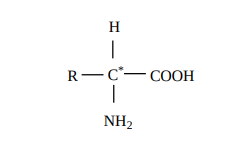
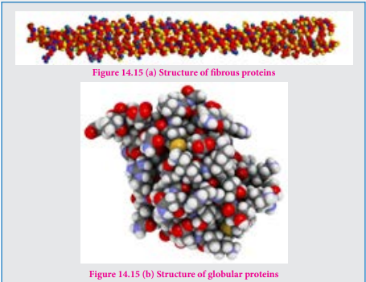
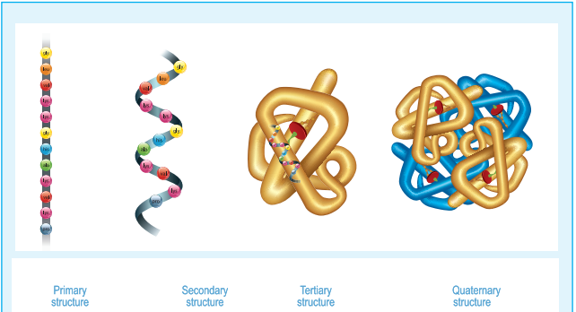
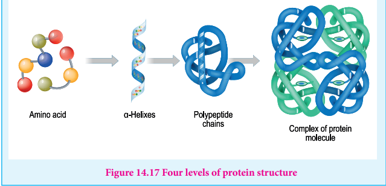
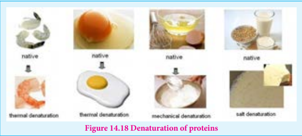

Proteins are most abundant biomolecules in all living organisms. The term protein is
derived from Greek word ‘Proteious’ meaning primary or holding first place. They are main functional units for the living things. They are involved in every function of the cell including respiration. Proteins are polymers of a-amino acids.

**14.2.1 Amino acids**

Amino acids are compounds which contain an amino group and a carboxylic acid group.
The protein molecules are made up a-amino acids which can be represented by the following general formula.

There are 20 a-amino acids commonly found in the protein molecules. Each amino acid is given a trivial name, a three letter code and a one letter code. In writing the amino acid sequence of a protein, generally either one letter or three letter codes are used.

**14.2.2 Classification of α-amino acids**

The amino acids are classified based on the nature of their R groups commonly known as side chain. They can be classified as acidic, basic and neutral amino acids. They can
also be classified as polar and non-polar (hydrophobic) amino acids.

Amino acids can also be classified as essential and non-essential amino acids based on the ability to be synthesise by the human. The amino acids that can be synthesised by us are called non-essential amino acids (Gly, Ala, Glu, Asp, Gln, Asn, Ser, Cys, Tyr & Pro) and those needs to be obtained through diet are called essential amino acids (Phe, Val, Thr, Trp, Ile, Met, His, Arg, Leu and Lys). These ten essential amino acids can be memorised by mnemonic called PVT TIM HALL.

Although the vast majority of plant and animal proteins are formed by these 20 a- amino acids, many other amino acids are also found in the cells. These amino acids are called as non–protein amino acids. Example: ornithine and citrulline (components of urea cycle where ammonia is converted into urea) 

**14.2.3 Properties of amino acid**

Amino acids are colourless, water soluble crystalline solids. Since they have both carboxyl group and amino group their properties differ from regular amines and carboxylic acids. The carboxyl group can lose a proton and become negatively charged or the amino group can accept a proton to become positively charged depending upon the pH of the solution. At a specific pH the net charge of an amino acid is neutral and this pH is called isoelectric point. At a pH above the isoelectric point the amino acid will be negatively charged and positively charged at pH values below the isoelectric point.

In aqueous solution the proton from carboxyl group can be transferred to the amino group of an amino acid leaving these groups with opposite charges. Despite having both positive and negative charges this molecule is neutral and has amphoteric behaviour. These ions are called zwitter ions.

Except glycine all other amino acids have at least one chiral carbon atom and hence are optically active. They exist in two forms namely D and L amino acids. However, L-amino acids are used predominantly by the living organism for synthesising proteins. Presence of D-amino acids has been observed rarely in certain organisms.

**14.2.4 Peptide bond formation**

The amino acids are linked covalently by peptide bonds. The carboxyl group of the first amino acid react with the amino group of the second amino acid to give an amide linkage between these amino acids. This amide linkage is called peptide bond. The resulting compound is called a dipeptide. Addition an another amino acid to this dipeptide a second peptide bond results in tripeptide. Thus we can generate tetra peptide, penta peptide etc… When you have more number of amino acids linked this way you get a polypeptide. If the number of amino acids are less it is called as a polypeptide, if it has large number of amino acids (and preferably has a function) then it is called a protein.

The amino end of the peptide is known as N-terminal or amino terminal while the carboxy end is called C-terminal or carboxy terminal. In general protein sequences are written from N-Terminal to C-Terminal. The atoms other than the side chains (R-groups) are called main chain or the back bone of the polypeptide. 

**14.2.5 Classification of proteins**

Proteins are classified based on their structure (overall shape) into two major types. They are fibrous proteins and globular proteins. 

**Fibrous proteins**

Fibrous proteins are linear molecules similar to fibres. These are generally insoluble in water and are held together by disulphide bridges and weak intermolecular hydrogen bonds. The proteins are often used as structural proteins. Example: Keratin, Collagen etc…

 **Globular proteins**

Globular proteins have an overall spherical shape. The polypeptide chain is folded into a spherical shape. These proteins are usually soluble in water and have many functions including catalysis (enzyme). Example: myoglobin, insuline

**14.2.6 Structure of proteins**

 Proteins are polymers of amino acids. Their three dimensional structure depends mainly on the sequence of amino acids (residues). The protein structure can be described at four hierarchal levels called primary, secondary, tertiary and quaternary structures as shown in the figure 14.16 
 
 **1. Primary structure of proteins:**

Proteins are polypeptide chains, made up of amino acids are connected through peptide bonds. The relative arrangement of the amino acids in the polypeptide chain is called the primary structure of the protein. Knowledge of this is essential as even small changes have potential to alter the overall structure and function of a protein.

**2. Secondary structure of proteins:** The amino acids in the polypeptide chain forms highly regular shapes (sub-structures) through the hydrogen bond between the carbonyl oxygen ( C=O) and the neighbouring amine hydrogen (-NH) of the main chain.α-Helix and β-strands or sheets are two most common sub-structures formed by proteins. 

**α-Helix**

In the a-helix sub-structure, the amino acids are arranged in a right handed helical (spiral) structure and are stabilised by the hydrogen bond between the carbonyl oxygen of one amino acid (nth residue) with amino hydrogen of the fifth residue (n+4th residue). The side chains of the residues protrude outside of the helix. Each turn of an a-helix contains about 3.6 residues and is about 5.4 Ao long. The amino acid proline produces a kink in the helical structure and often called as a helix breaker due to its rigid cyclic structure. 

**β-Strand**

β-Strands are extended peptide chain rather than coiled. The hydrogen bonds occur between main chain carbonyl group one such strand and the amino group of the adjacent strand resulting in the formation of a sheet like structure. This arrangement is called β-sheets.

**3. Tertiary structure:** 

The secondary structure elements (a-helix & β-sheets) further folds to form the three dimensional arrangement. This structure is called tertiary structure of the polypeptide (protein). Tertiary structure of proteins are stabilised by the interactions between the side chains of the amino acids. These interactions include the disulphide bridges between cysteine residues, electrostatic, hydrophobic, hydrogen bonds and van der Waals interactions. 

**4. Quaternary Structure**

Some proteins are made up of more than one polypeptide chains. For example, the oxygen transporting protein, haemoglobin contains four polypeptide chains while DNA polymerase enzyme that make copies of DNA, has ten polypeptide chains. In these proteins the individual polypeptide chains (subunits) interacts with each other to form the multimeric structure which are known as quaternary structure. The interactions that stabilises the tertiary structures also stabilises the quaternary structures.

**14.2.7 Denaturation of proteins**

Each protein has a unique three-dimensional structure formed by interactions such
as disulphide bond, hydrogen bond, hydrophobic and electrostatic interactions. These interactions can be disturbed when the protein is exposed to a higher temperature, by adding certain chemicals such as urea, alteration of pH and ionic strength etc., It leads to the loss of the three-dimensional structure partially or completely. The process of a losing its higher order structure without losing the primary structure, is called denaturation. When a protein denatures, its biological function is also lost.

Since the primary structure is intact, this process can be reversed in certain proteins. This can happen spontaneously upon restoring the original conditions or with the help of special enzymes called cheperons (proteins that help proteins to fold correctly).

Example: coagulation of egg white by action of heat.

**14.2.8 Importance of proteins**

Proteins are the functional units of living things and play vital role in all biological processes

1.All biochemical reactions occur in the living systems are catalysed by the catalytic proteins called enzymes.

2.Proteins such as keratin, collagen act as structural back bones.

3.Proteins are used for transporting molecules (Haemoglobin), organelles (Kinesins) in the cell and control the movement of molecules in and out of the cells (Transporters).

4.Antibodies help the body to fight various diseases.

5.Proteins are used as messengers to coordinate many functions. Insulin and glucagon control the glucose level in the blood.

6.Proteins act as receptors that detect presence of certain signal molecules and activate the proper response.

7.Proteins are also used to store metals such as iron (Ferritin) etc.

**14.2.9 Enzymes:**

Th ere are many biochemical reactions that occur in our living cells. Digestion of food and harvesting the energy from them, and synthesis of necessary molecules required for various cellular functions are examples for such reactions. All these reactions are catalysed by special proteins called enzymes. Th ese biocatalysts accelerate the reaction rate in the orders of 105 and also make them highly specifi c. Th e high specifi city is followed allowing many reactions to occur within the cell. For example, the _Carbonic anhydrase_ enzyme catalyses the interconversion of carbonic acid to water and carbon dioxide. Sucrase enzyme catalyses the hydrolysis of sucrose to fructose and glucose. Lactase enzyme hydrolyses the lactose into its constituent monosaccharides, glucose and galactose.

**14.2.10 Mechanism of enzyme action:**

Enzymes are biocatalysts that catalyse a specifi c biochemical reaction. Th ey generally activate the reaction by reducing the activation energy by stabilising the transition state. In a typical reaction enzyme (E) binds with the substrate (S) molecule reversibly to produce an enzyme-substrate complex (ES). During this stage the substrate is converted into product and the enzyme becomes free, and ready to bind to another substrate molecule. More detailed mechanism is discussed in the unit XI surface chemistry.

E(enzyme)+S(substate)⇌[ES]Enzyme-substate complex

.png)

