**INTRODUCTION** Chemistry touches every aspect of our lives. The three-basic requirement of our life: food,

clothes, shelter are all basically chemical compounds. Infact, life itself is a complicated system of interrelated chemical process. In this unit, we will learn the chemistry involved in the field of medicines, food materials, cleansing agents and polymers.

## Drug
 The word drug is derived from the French word “drogue” meaning “dry herb”. A drug is

a substance that is used to modify or explore physiological systems or pathological states for the benefit of the recipient. It is used for the purpose of diagnosis, prevention, cure/relief of a disease.The drug which interacts with macromolecular targets such as proteins to produce a therapeutic and useful biological response is called medicine. The specific treatment of a disease using medicine is known as chemotherapy. An ideal drug is the one which is non- toxic, bio-compatible and bio-degradable, and it should not have any side effects. Generally, most of the drug molecules that are used now a days have the above properties at lower concentrations. However, at higher concentrations, they have side effects and become toxic. The medicinal value of a drug is measured in terms of its therapeutic index, which is defined as the ratio between the maximum tolerated dose of a drug (above which it become toxic) and the minimum curative dose (below which the drug is ineffective). Higher the value of therapeutic index, safer is the drug.

### Classification of drugs:

Drugs are classified based on their properties such as chemical structure, pharmacological effect, target system, site of action etc. We will discuss some general classifications here.

**Classification based on the chemical structure:**

In this classification, drugs with a common chemical skeleton are classified into a single group. For example, ampicillin, amoxicillin, methicillin etc.. all have similar structure and are classified into a single group called penicillin. Similarly, we have other group of drugs such as opiates, steroids, catecholamines etc. Compounds having similar chemical structure are expected to have similar chemical properties. However, their biological actions are not always similar. For example, all drugs belonging to penicillin group have same biological action, while groups such as barbiturates, steroids etc.. have different biological action.

**Penicillins**

**Classification based on Pharmacological effect:**

In this classification, the drugs are grouped based on their biological effect that they produce on the recipient. For example, the medicines that have the ability to kill the pathogenic bacteria are grouped as antibiotics. This kind of grouping will provide the full range of drugs that can be used for a particular condition (disease). The physician has to carefully choose a suitable medicine from the available drugs based on the clinical condition of the recipient.

**Examples:**

Antibiotic drugs: amoxicillin, ampicillin,cefixime, cefpodoxime, erythromycin, tetracycline etc..

Antihypertensive drugs: propranolol, atenolol, metoprolol succinate, amlodipine etc…

**Classification based on the target system (drug action):**

In this classification, the drugs are grouped based on the biological system/process, that they target in the recipient. This classification is more specific than the pharmacological classification.For example, the antibiotics streptomycin and erythromycin inhibit the protein synthesis (target process) in bacteria and are classified in a same group. However, their mode of action is different. Streptomycin inhibits the initiation of protein synthesis, while erythromycin prevents the incorporation of new amino acids to the protein.

**Classification based on the site of action (molecular target):**

The drug molecule interacts with biomolecules such as enzymes, receptors etc,, which are referred as drug targets. We can classify the drug based on the drug target with which it binds. This classification is highly specific compared to the others. These compounds often have a common mechanism of action, as the target is the same.

### Drug–target Interaction:

The biochemical processes such as metabolism (which is responsible for breaking down the food molecules and harvest energy in the form of ATP and biosynthesis of necessary biomolecules from the available precursor molecules using many enzymes),cell-signaling (senses any change in the environment using the receptor molecules and send signals to various processes to elicit an appropriate response) etc… are essential for the normal functioning of our body. These routine processes may be disturbed by any external factors such as microorganism, chemicals etc.. or by a disorder in the system itself. Under such conditions we may have to take medicines to restore the normal functioning of the body.

These drug molecules interact with biomolecules such as proteins, lipids, etc..that are responsible for different functions of the body. For example, proteins which act as biological catalysts are called enzymes and those which are important for communication systems are called receptors. The drug interacts with these molecules and modify the normal biochemical reactions either by modifying the enzyme activity or by stimulating/suppressing certain receptors.

**Enzymes as drug targets:**

In all living systems, the biochemical reactions are catalysed by enzymes. Hence, these enzyme actions are highly essential for the normal functioning of the system. If their normal enzyme activity is inhibited, then the system will be aff ected. Th is principle is usually applied to kill many pathogens.

We have already learnt that in enzyme catalysed reactions, the substrate molecule binds to the active site of the enzyme by means of the weak interaction such as hydrogen bonding, van der Waals force etc… between the amino acids present in the active site and the substrate.

When a drug molecule that has a similar geometry (shape)as the substrate is administered, it can also bind to the enzyme and inhibit its activity.In other words, the drug acts as an inhibitor to the enzyme catalyst. Th ese type of inhibitors are oft en called competitive inhibitors. For example the antibiotic sulphanilamide, which is structurally similar to _p_\-aminobenzoic acid (PABA) inhibits the bacterial growth. Many bacteria need PABA in order to produce an important coenzyme, folic acid. When the antibiotic sulphanilamide is administered, it acts as a competitive inhibitor to the enzyme dihydropteroate synthase (DHPS) in the biosynthetic pathway of converting PABA into folic acid in the bacteria. It leads to the folic acid defi ciency which retards the growth of the bacteria and can eventually kill them.

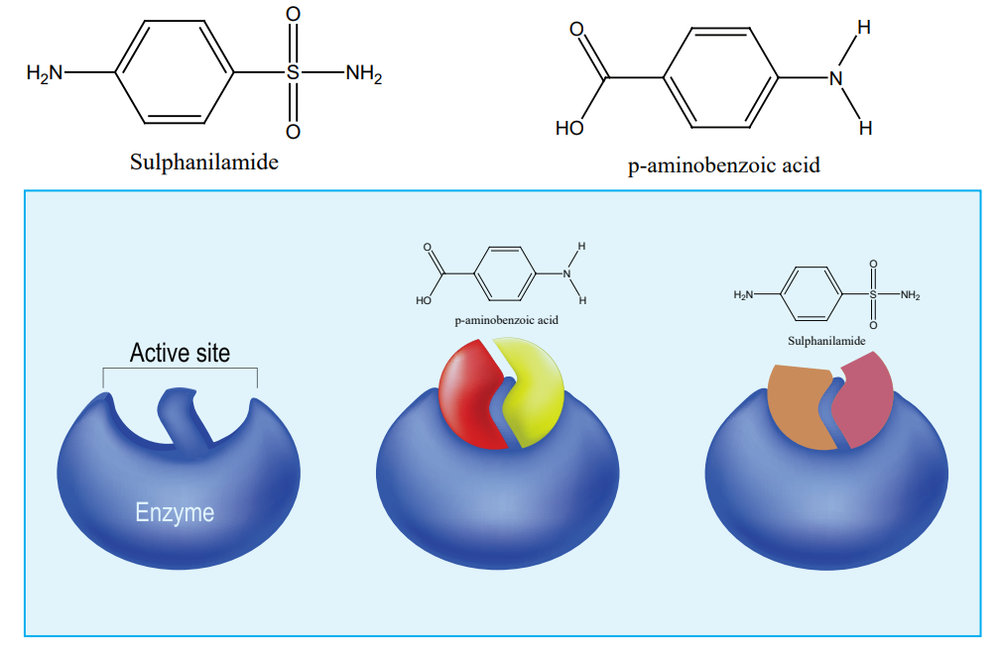
<!-- NH2S

O

O

H2N

Sulphanilamide

O

HO

N

H

H

p-aminobenzoic acid

In certain enzymes, the inhibitor molecule binds to a diff erent binding site, which is commonly referred to as allosteric site, and causes a change in its active site geometry (shape). As a result, the substrate cannot bind to the enzyme. Th is type of inhibitors are called allosteric inhibitors.

NH2S

O

O

H2N

Sulphanilamide

O

HO

N

H

H

p-aminobenzoic acid

XII U15 Chemistry in Action.indd 275 2/19/2020 5:17:01 PM

www.tntextbooks.in -->

**Receptor as drug targets:**

Many drugs exert their physiological effects by binding to a specific molecule called a receptor whose role is to trigger a response in a cell. Most of the receptors are integrated with the cell membranes in such a way that their active site is exposed to outside region of the cell membrane. The chemical messengers, the compounds that carry messages to cells, bind to the active site of these receptors. This brings about the transfer of message into the cell. These receptors show high selectivity for one chemical messenger over the others. If we want to block a message, a drug that binds to the receptor site should inhibit its natural function. Such drugs are called **antagonists**. In contrast, there are drugs which mimic the natural messenger by switching on the receptor. These type of drugs are called agonists and are used when there is lack of chemical messenger.

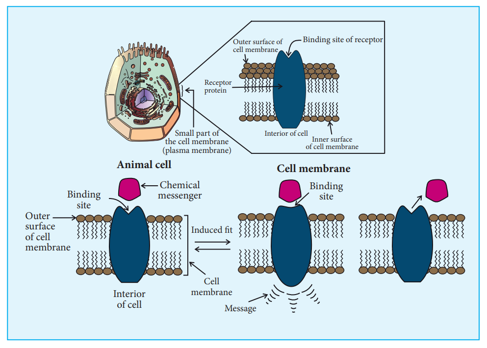

For example, when adenosine binds to the adenosine receptors, it induces sleepiness. On the other hand, the antagonist drug caffeine binds to the adenosine receptor and makes it inactive. This results in the reduced sleepiness (wakefulness).

The agonist drug, morphine, which is used as a pain killer, binds to the opioid receptors and activates them. This supress the neuro transmitters that causes pain.

Most receptors are chiral and hence different enantiomers of a drug can have different effect

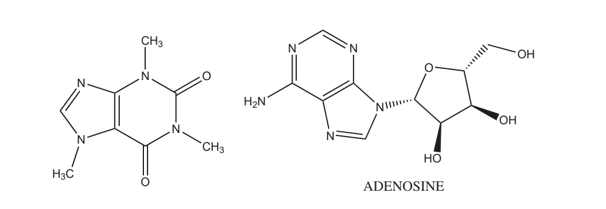

**Therapeutic action of Different classes of Drugs:** The developments in the field of biology allowed us to understand various biological

process and their mechanism in detail. This enabled to develop new safer efficient drugs. For example, to treat acidity, we have been using weak bases such as aluminium and magnesium hydroxides. But these can make the stomach alkaline and trigger the production of much acid. Moreover, This treatment only relives the symptoms and does not control the cause. Detailed studies reveal that histamines stimulate the secretion of HCl by activating the receptor in the stomach wall. This findings lead to the design of new drugs such as cimetidine, ranitidine etc.. which binds the receptor and inactivate them. These drugs are structurally similar to histamine.In this section, we shall discuss the therapeutic action of a few important classes of drugs.

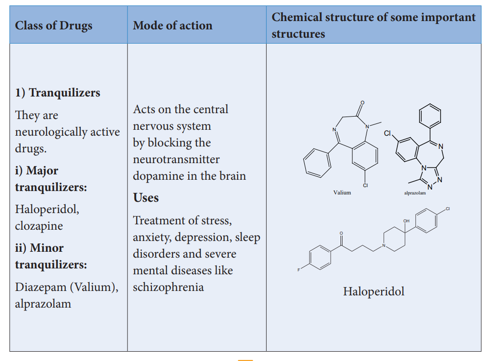

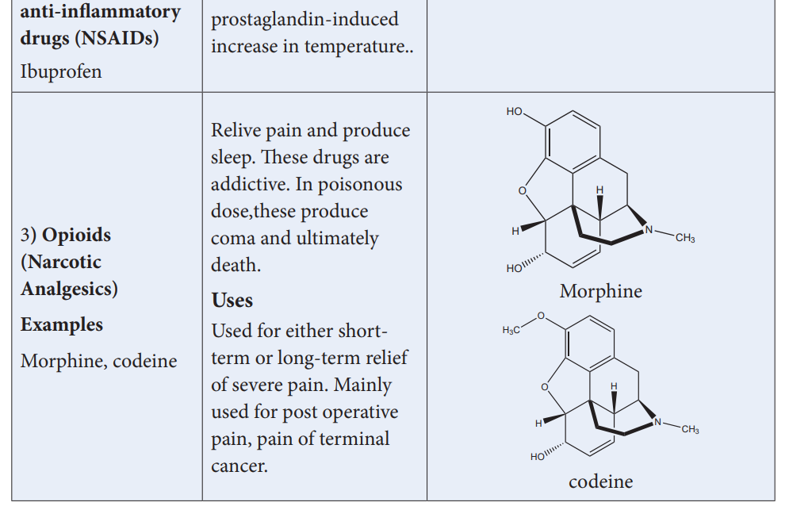

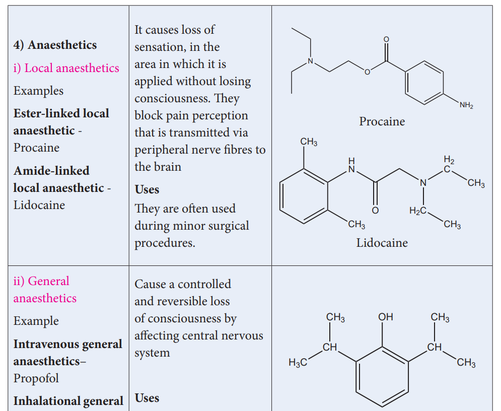

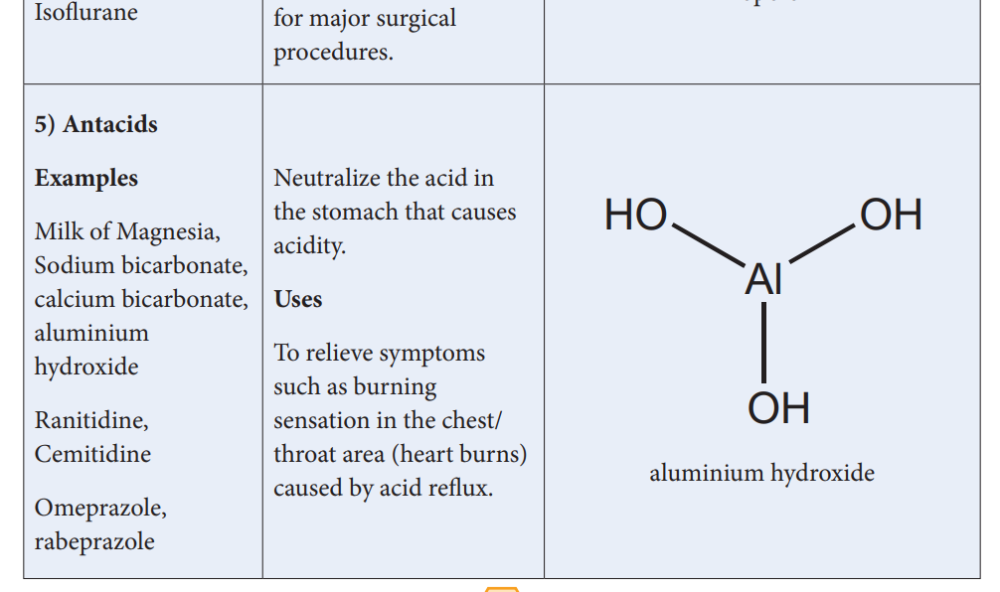

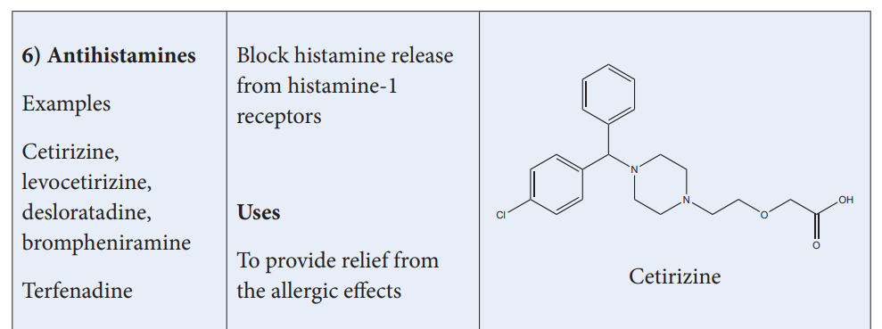

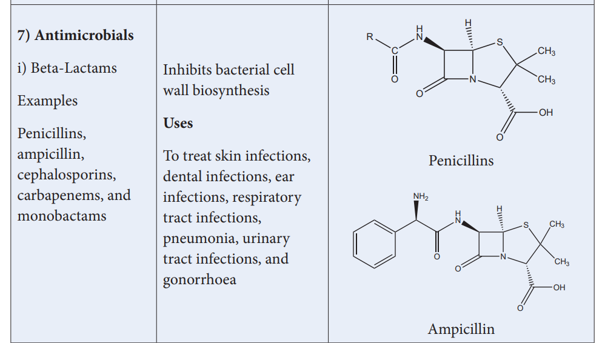

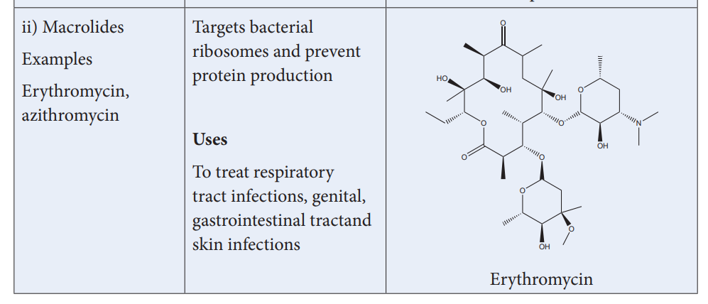

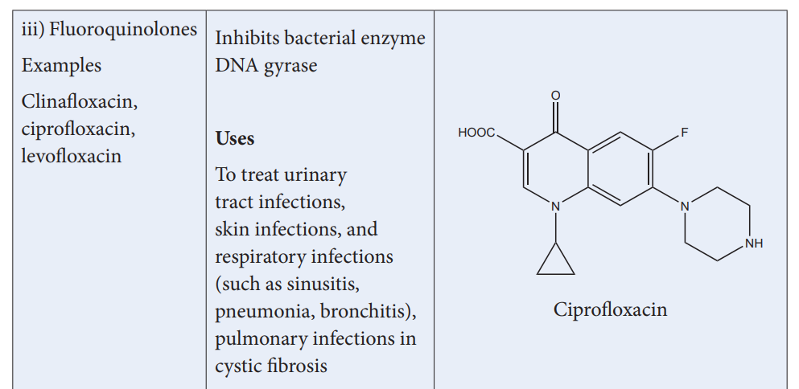

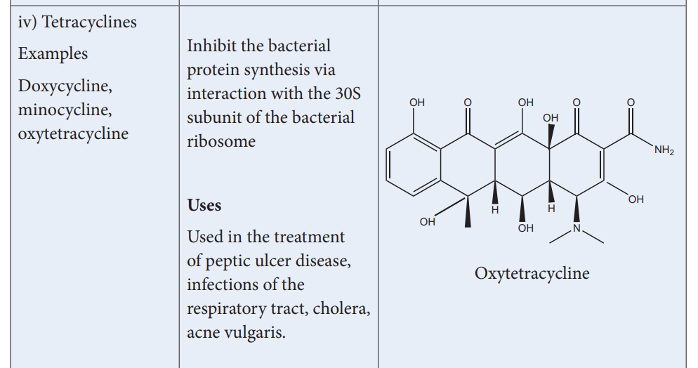

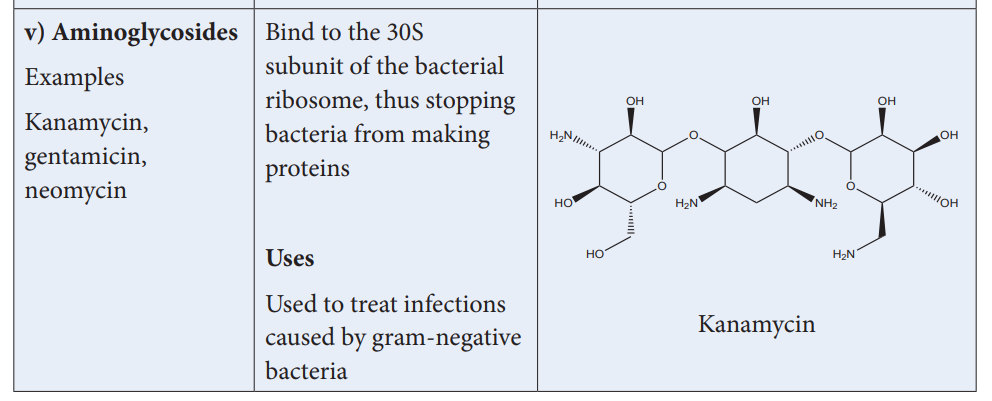

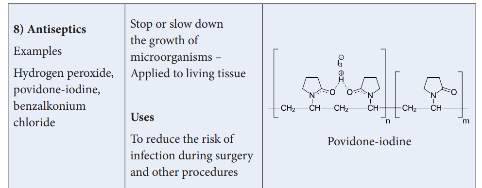

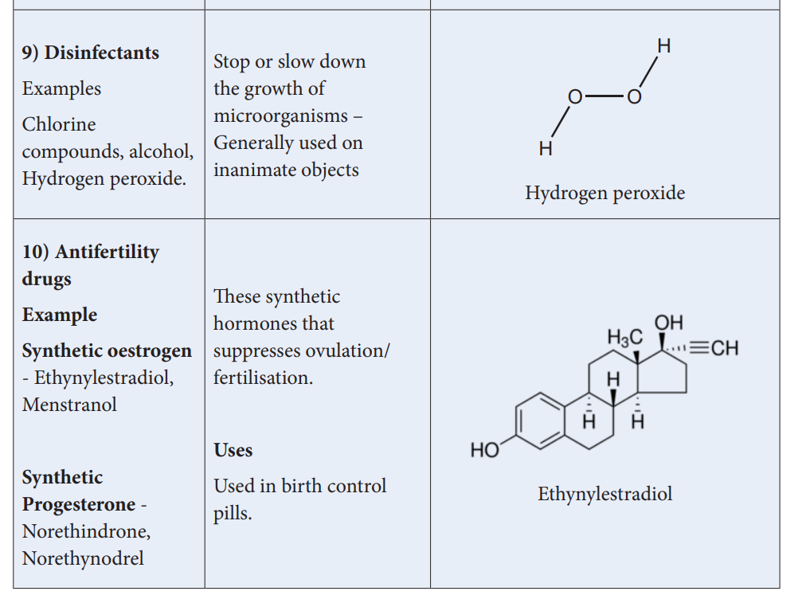

<!-- 
| Class of Drugs |Mode of action |Chemical structure of some important structures |
|------|------|------|
| 1) Tranquilizersey are neurologically active drugs. i) Major tranquilizers:Haloperidol, clozapineii) Minor tranquilizers:Diazepam (Valium), alprazolam |Acts on the central ner vous system by blocking the neurotransmitter Usdop easmine in the brainTreatment of stress, anxiety, depression, sleep disorders and severe mental diseases like schizophrenia |ON N ClNNNNClValium alprazolamClOHHaloperidolONF |
  

278

**2) Analgesics (Non – narcotic)** Analgesics reduce the pain without causing impairment of consciousness. **i) Anti- inflammatory drugs Example** Acetaminophen or paracetamol, Ibuprofen, Asprin. **ii) Antipyretics** Example **Salicylates** Acetylsalicylic acid (aspirin), **Acetaminophen or Paracetamol iii) Nonsteroidal anti-inflammatory drugs (NSAIDs)** Ibuprofen

They alleviate pain by reducing local inflammatory responses **Uses** Used for short-term pain relief and for modest painlike headache, muscle strain, bruising, or arthritis. These drugs have many other effects such as reducing fever (antipyretic) and preventing platelet coagulation. Due to this property, aspirin finds useful in the prevention of heart attacks Reduces fever by causing the hypothalamus to override a prostaglandin-induced increase in temperature..

O

O

C

COOH

CH3

Acetylsalicylic acid (aspirin)

OH O

N H

H3C

Paracetamol

HOOC

Ibuprofen

3**) Opioids (Narcotic Analgesics)**

**Examples**

Morphine, codeine

Relive pain and produce sleep. These drugs are addictive. In poisonous dose,these produces coma and ultimately death.

**Uses** Used for either short- term or long-term relief of severe pain. Mainly used for post operative pain, pain of terminal cancer.

O

HO

H

HO

H

N CH3

Morphine

O

O

H

HO

H

N CH3

H3C

codeine

XII U15 Chemistry in Action.indd 278 2/19/2020 5:17:09 PM

www.tntextbooks.in

| 2) Analgesics (Non – narcotic)Analgesics reduce the pain without causing impairment of consciousness. i) Anti-inammator y drugsExample Acetaminophen or paracetamol,Ibuprofen, Asprin.ii) AntipyreticsExample Salic ylatesAcetylsalicylic acid (aspirin), Acetaminophen or Paracetamoliii) Nonsteroidal anti-inammator y drugs (NSAIDs)Ibuprofen |ey alleviate pain by reducing local inUseasmmator y responsesUsed for short-term pain relief and for modest painlike headache, muscle strain, bruising, or arthritis.ese drugs have many other eects such as reducing fever (antipyretic) and preventing platelet coagulation. Due to this property, aspirin nds useful in the prevention of heart attacksReduces fever by causing the hypothalamus to override a prostaglandin-induced increase in temperature.. |OO C CHCOOH3Acetylsalicylic acid (aspirin)ParacetamolOHOH3C NHIbuprofenHOOC |
|------|------|------|
| 3) Opioids (NarcoticAnalgesics)Examples Morphine, codeine |Relive pain and produce sleep. ese drugs are addictive. In poisonous dose,these produces coma and ultimately deUs aes th.Used for either short-term or long-term relief of severe pain. Mainly used for post operative pain, pain of terminal cancer. |HOO HMorphineH N CH3HOOH3CO codein H eH N CH3HO |
  

279

**4) Anaesthetics**

i) Local anaesthetics

Examples

**Ester-linked local anaesthetic** - Procaine

**Amide-linked local anaesthetic** - Lidocaine

It causes loss of sensation, in the area in which it is applied without losing consciousness. They block pain perception that is transmitted via peripheral nerve fibres to the brain

**Uses** They are often used during minor surgical procedures.

NH2

O N

O

Procaine CH3

CH3

O

H N

H2C

N

CH3

CH3

H2 C

Lidocaine

ii) General anaesthetics

Example

**Intravenous general anaesthetics**– Propofol

**Inhalational general anaesthetics**\- Isoflurane

Cause a controlled and reversible loss of consciousness by affecting central nervous system

**Uses**

They are often used for major surgical procedures.

OH

CH

CH3

CH3

CH

CH3

H3C

Propofol

**5) Antacids**

**Examples**

Milk of Magnesia, Sodium bicarbonate, calcium bicarbonate, aluminium hydroxide

Ranitidine, Cemitidine

Omeprazole, rabeprazole

Neutralize the acid in the stomach that causes acidity.

**Uses**

To relieve symptoms such as burning sensation in the chest/ throat area (heart burns) caused by acid reflux.

Al OHHO

OH aluminium hydroxide

XII U15 Chemistry in Action.indd 279 2/19/2020 5:17:10 PM

www.tntextbooks.in

| 4) Anaestheticsi) Local anaestheticsExamples Ester-linked local anaesthetic - ProcaineAmide-linked local anaesthetic - Lidocaine |It causes loss of sensation, in the area in which it is applied without losing consciousness. ey block pain perception that is transmitted via peripheral ner ve bres to the brainUses ey are oen used during minor surgical procedures. |ON ProcaineONH2CH3 H HN C2N CHLidocaine 3O H CCH 2 CH3 3 |
|------|------|------|
| ii) General anaestheticsExample Intravenous general anaesthetics– PropofolInhalational general anaesthetics- Isourane |Cause a controlled and reversible loss of consciousness by aecting central ner vous systemUses ey are oen used for major surgical procedures. |CH OH CHCH 3 CH 3H C CH3 3Propofol |
| 5) AntacidsExamples Milk of Magnesia, Sodium bicarbonate, calcium bicarbonate, aluminium hydroxideR anitidine, CemitidineOmeprazole, rabeprazole |Neutralize the acid in the stomach that causes acidity.Uses To relieve symptoms such as burning sensation in the chest/throat area (heart burns) caused by acid reux. |HO OHAlOHaluminium hydroxide |
  

280

**6) Antihistamines**

Examples

Cetirizine, levocetirizine, desloratadine, brompheniramine

Terfenadine

Block histamine release from histamine-1 receptors

**Uses**

To provide relief from the allergic effects

N

N O

OH Cl

O

Cetirizine

**7) Antimicrobials**

i) Beta-Lactams

Examples

Penicillins, ampicillin, cephalosporins, carbapenems, and monobactams

Inhibits bacterial cell wall biosynthesis

**Uses**

To treat skin infections, dental infections, ear infections, respiratory tract infections, pneumonia, urinary tract infections, and gonorrhoea

N

S

CH3

CH3

O

OH

H N

C

O O

R H

Penicillins

O O

H N

NH2

N

S

H

CH3

CH3

O

OH

Ampicillin

ii) Macrolides

Examples

Erythromycin, azithromycin

Targets bacterial ribosomes and prevent protein production

**Uses**

To treat respiratory tract infections, genital, gastrointestinal tractand skin infections

O

O

OH HO

O O

O

OH

O

OH

O

O

N

OH

Erythromycin

XII U15 Chemistry in Action.indd 280 2/19/2020 5:17:11 PM

www.tntextbooks.in

| 6) AntihistaminesExamples Cetirizine, levocetirizine, desloratadine, brompheniramine Terfenadine |Block histamine release from histamine-1 receptorsUsesTo provide relief from the allergic eects |CN etirizineN OHCl OO |
|------|------|------|
| 7) Antimicrobialsi) B eta-LactamsExamples Penicillins, ampicillin, cephalosporins, carbapenems, and monobactams |Inhibits bacterial cell wall biosynthesisUses To treat skin infections, dental infections, ear infections, respirator y tract infections, pneumonia, urinar y tract infections, and gonorrhoea |H HR N SC CH3O N CHO Penicillins 3OHONH2 H HN S CH3AOmpicillin N CHO3OHO |
| ii) MacrolidesExamples Er ythromycin, azithromycin |Targets bacterial ribosomes and prevent protein productionUses To treat respirator y tract infections, genital, gastrointestinal tractand skin infections |OHOOH OOHO O NOHO OEr ytOhromycinOOH |
  

281

iii) Fluoroquinolones

Examples

Clinafloxacin, ciprofloxacin, levofloxacin

Inhibits bacterial enzyme DNA gyrase

**Uses**

To treat urinary tract infections, skin infections, and respiratory infections (such as sinusitis, pneumonia, bronchitis), pulmonary infections in cystic fibrosis

N

O

HOOC F

N

NH

Ciprofloxacin

iv) Tetracyclines

Examples

Doxycycline, minocycline, oxytetracycline

Inhibit the bacterial protein synthesis via interaction with the 30S subunit of the bacterial ribosome

**Uses**

Used in the treatment of peptic ulcer disease, infections of the respiratory tract, cholera, acne vulgaris.

OH O OH

OH

OH

OH

H

OH

H

O

NH2

O

N

Oxytetracycline

**v) Aminoglycosides**

Examples

Kanamycin, gentamicin, neomycin

Bind to the 30S subunit of the bacterial ribosome, thus stopping bacteria from making proteins

**Uses**

Used to treat infections caused by gram-negative bacteria

O H2N

O

NH2

O

O

HO H2N

OH

OH

OHOHOH

H2N

HO

Kanamycin

XII U15 Chemistry in Action.indd 281 2/19/2020 5:17:11 PM

www.tntextbooks.in

| iii) FluoroquinolonesExamples Clinaoxacin, ciprooxacin, levooxacin |Inhibits bacterial enzyme DNA g yraseUses To treat urinar y tract infections, skin infections, and respirator y infections (such as sinusitis, pneumonia, bronchitis), pulmonar y infections in cystic brosis |OHOOC FN NCiprooxacinNH |
|------|------|------|
| iv) TetracyclinesExamples Doxycycline, minocycline, oxytetracycline |Inhibit the bacterial protein synthesis via interaction with the 30S subunit of the bacterial ribosomeUses Used in the treatment of peptic ulcer disease, infections of the respirator y tract, cholera, acne vulgaris. |OH O OH O OOHNH2Oxytetracycline OHH HOH OH N |
| v) AminoglycosidesExamples Kanamycin, gentamicin, neomycin |Bind to the 30S subunit of the bacterial ribosome, thus stopping bacteria from making proteinsUses Used to treat infections caused by gram-negative bacteria |OH OH OHH N O O OH2O OHO H NKanamycin NH OH2 2HO H N2 |
  

282

**8) Antiseptics**

Examples

Hydrogen peroxide, povidone-iodine, benzalkonium chloride

Stop or slow down the growth of microorganisms – Applied to living tissue

**Uses**

To reduce the risk of infection during surgery and other procedures

Povidone-iodine

**9) Disinfectants**

Examples

Chlorine compounds, alcohol, Hydrogen peroxide.

Stop or slow down the growth of microorganisms – Generally used on inanimate objects

O O

H

H

Hydrogen peroxide

**10) Antifertility drugs**

**Example**

**Synthetic oestrogen** \- Ethynylestradiol, Menstranol

**Synthetic Progesterone** - Norethindrone, Norethynodrel

Th ese synthetic hormones that suppresses ovulation/ fertilisation.

**Uses**

Used in birth control pills.

Ethynylestradiol -->
