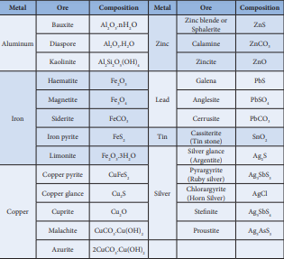

# Occurrence of metals
 In general, pure metals are shiny and malleable, however, most of them are found in nature as compounds with different properties. Metals having least chemical reactivity such as copper, silver, gold and platinum occur in significant amounts as native elements. Reactive metals such as alkali metals usually occurs in their combined state and are extracted using suitable metallurgical process.

## Mineral and ore

A naturally occurring substance obtained by mining which contains the metal in free state or in the form of compounds like oxides, sulphides etc... is called a **mineral**. In most of the minerals, the metal of interest is present only in small amounts and some of them contains a reasonable percentage of metal. For example iron is present in around 800 minerals. However, some of them such as hematite magnetite etc., containing high percentage of iron are commonly used for the extraction of iron. Such minerals that contains a high percentage of metal, from which it can be extracted conveniently and economically are called **ores**. Hence all ores are minerals but all minerals are not ores. Let us consider another example, bauxite and china clay (Al2O3.2SiO2.2H2O). Both are minerals of aluminium. However, aluminium can be commercially extracted from bauxite while extraction from china clay is not a profitable one. Hence the mineral, bauxite is an ore of aluminium while china clay is not.

The extraction of a metal of interest from its ore consists of the following metallurgical processes.

(i) concentration of the ore

(ii) extraction of crude metal 

(iii) refining of crude metal

**Table 1.1 List of some metals and their common ores with their chemical formula**

| Metal |Ore |C omposition |Metal |Ore |C omposition |
|------|------|------|------|------|------|
| Aluminum |Bauxite |nH OAl O .2 3 2 |Zinc |Zinc blende or Sphalerite |ZnS |
|           Diaspore |Al O .H O2 3 2 |Calamine |ZnCO3 |
| Kaolinite |Al Si O (OH)2 2 5 4 |Zincite |ZnO |
| Iron |Haematite |Fe O2 3 |Lead |Galena |PbS |
| Magnetite |Fe O3 4 |Anglesite |PbSO4 |
| Siderite |FeCO3 |Cerrusite |PbCO3 |
| Iron pyrite |FeS2 |Tin |Cassiterite (Tin stone) |SnO2 |
| Limonite |Fe O .3H O2 3 2 |Silver |Silver glance (Argentite) |Ag S2 |
| Copper |Copper pyrite |CuFeS2 |Pyrarg yrite (Ruby silver) |Ag SbS3 3 |
| Copper glance |Cu S2 |Chlorarg yrite (Horn Silver) |AgCl |
| Cuprite |Cu O2 |Stenite |Ag SbS5 4 |
| Malachite |CuCO .Cu(OH)3 2 |Proustite |Ag AsS3 3 |
| Azurite |2CuCO .Cu(OH)3 2 |
  
