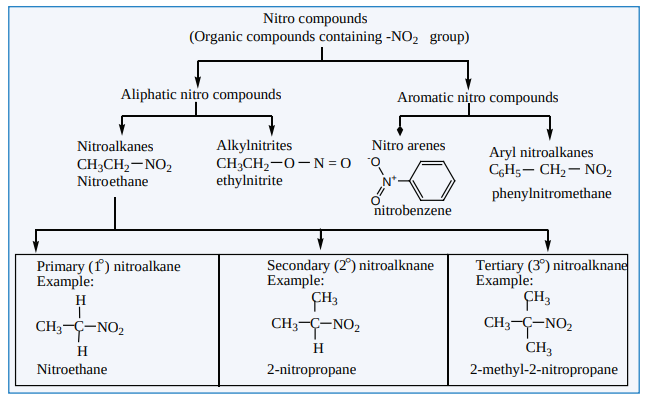
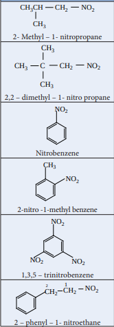
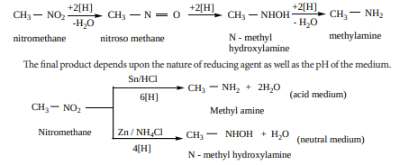
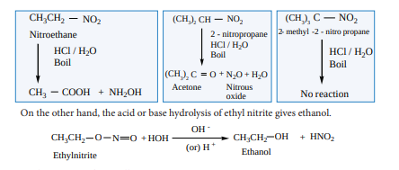
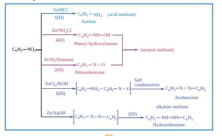
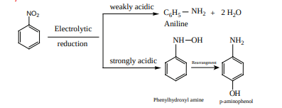
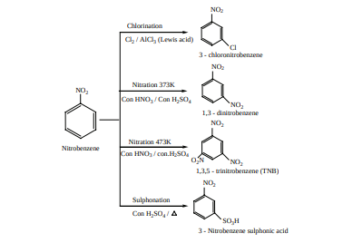
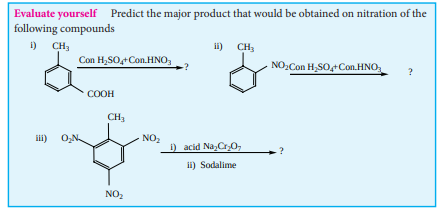

## NITRO COMPOUNDS
 Nitro compounds are considered as the derivaties of hydrocarbons. If one of the hydrogen atom of hydrocarbon is replaced by the -NO 2 group, the resultant organic compound is called a nitrocompound.

### Classification of nitrocompounds

Nitro compounds (Organic compounds containing -NO2 group)

Aliphatic nitro compounds Aromatic nitro compounds

Nitroalkanes CH3CH2 NO2 Nitroethane

Alkylnitrites CH3CH2 O N = O ethylnitrite

Nitro arenes Aryl nitroalkanes C6H5 CH2 NO2N+

O

\-O

nitrobenzene phenylnitromethane

Primary (1 ) nitroalkane Example:

Nitroethane



CH3

H

H

NO2C

Secondary (2 ) nitroalknane Example:

2-nitropropane

CH3

H

CH3

NO2C

Tertiary (3 ) nitroalknane Example:

2-methyl-2-nitropropane



CH3

CH3

CH3

NO2C

XII U13-Organic Nitrogen Compounds.indd 197 2/19/2020 5:16:54 PM

www.tntextbooks.in

  

198

Nitroalkanes are represented by the formula, R-NO2 where R is an alkyl group (C H -)n 2n+1 . Nitroalkanes are further classified into primary, secondary, tertiary nitroalkanes on the basis of type of carbon atom to which the nitro (-NO )2 group is attached.

### Nomenclature of nitroalkanes

In the IUPAC nomenclature, the nitroalkanes are named by adding prefix nitro before the name of alkane, the position of the nitro group is indicated by number.

| Compound (common name, Structural formula, IUPAC Name) |  |
| ----------- | ----------- |
|  |  |

| Compound(common name, Structural formula, IUPAC Name) |IUPAC Name |
|------|------|------|------|------|
| |**Prefix with position number** |**Root used** |**Primary suffx** |**Secondary Suffix** |
| \ch{H3C-CH3} CH CH CH NO2- Met3CHhyl – 1- ni 2tropropa 2ne3 |2- Methyl – 1- nitro |prop |ane |– |
| CHCH C CH NO3CH3 22,2 – dimethyl – 1- nitro propane3 |2,2 – dimethyl – 1- nitro |prop |ane |– |
| NO2Nitrobenzene |nitro |benzene |– |– |
| CH3 NO2-nitro -1-methyl benzen2 e |2-nitro-1-methyl |benzene |– |– |
| NO21,3,5 – tNO rinitrobenzen NO e2 2 |1,3,5 – trinitro |benzene |– |– |
| CH CH NO12 – phenyl – 1- ni2 2 tr 2oethan 2e |2 – phenyl – 1- nitro |eth |ane |
  

199

### ISOMERISM
 Nitroalkanes exhibit chain and position isomerism among their own class and functional isomerism with alkyl nitrites and special type tautomerism can also exist in nitro alkanes having an α-H atom. For example, nitro compounds having the molecular formula C H NO 4 9 2 exhibit the following isomerisms. **Isomerism Structural formula of isomers Chain isomerism**: They differ in the length of carbon chain.

| Isomerism |Structural formula of  isomers |
|------|------|
| Chain isomerism: ey dier in the length of carbon chain. |CH3CH2CH2CH2 NO2 1 - nitrobutane and CH3CHCH2 NO2 CH3 2 - methyl - 1-nitropropane |
| Positionisomerism: ey dier in the position of nitro group. |CH3CH2CH2CH2 NO2,1 - nitrobutane CH3CHCH2CH3 NO2 and CH3 C CH3 CH3 NO2 2 - nitrobutane 2 - methyl - 2-nitropropane|
| Functional isomerism:Nitroalkanesexhibit functional isomerism with alkylnitrites |CH3CH2CH2CH2 NO2 1 - nitrobutane and CH3CH2CH2CH2 O N = O butyl nitrite |

**Tautomerism:** Primary and secondary nitroalkanes, having α-H , also show an equilibrium mixture of two tautomers namely nitro – and aci – form

Tertiary nitro alkanes donot exhibit tautomerism due to absence of α-H atom.

| S.No. |Nitro form |Aci – form |
|------|------|------|
| 1. |Less acidic |More acidic |
| 2. |Dissolves in NaOH slowly |Dissolves in NaOH instantly |
| 3. |Decolourises FeCl solution3 |With gives reddish brown colourFeCl3 |
| 4. |Electrical conductivity is low |Electrical conductivity is high |
  

200

### Acidic nature of nitro alkanes

The α-H atom of 1 & 2 nitroalkanes show acidic character because of the electron with drawing effect of NO2 group. These are more acidic than aldehydes, ketones, ester and cyanides. Nitroalkanes dissolve in NaOH solution to form a salt. Aci – nitro derivatives are more acidic than nitro form. When the number of alkyl group attached to α carbon increases, acidity decreases. due to +I effect of alkyl groups.

CH3 NO2 > CH3CH2 NO2 NO2> CH3 CH3 CH NO2

**Evaluate yourself** Write all possible isomers for the following compounds.

i) C H -NO2 5 2 ii) C H -NO3 7 2

### Preparation of nitroalkanes 
1) From alkyl halides: (Laboratory method)

a) Alkyl bromides (or) iodides on heating with ethanolic solution of potassium nitrite gives nitroethane.

CH3CH2 -Br + K ethanol/SN CH3CH2-NO2 NO Ethyl bromide 2 D → 2 + KBr Nitroethane

The reaction follows SN2 mechanism.

This method is not suitable for preparing nitrobenzene because the bromine directly attached to the benzene ring cannot be cleaved easily.

**2) Vapour phase nitration of alkanes: (Industrial method)**

Gaseous mixture of methane and nitric acid passed through a red hot metal tube to give nitromethane.

nitro methaneMethane

675 KCH + H CH - +H O3 2Red hot Si tube4(g NO NO23 (g) ) →

Except methane, other alkanes (upto n – hexane) give a mixture of nitroalkanes due to C-C cleavage. The individual nitro alkanes can be separated by fractional distillation.

CH3-CH3 Ethane

+H 675 K CH3CH2- Nitroethane(73%)

\+ CH3NNO3 NO2 → O2 Nitromethane (27%)

**3) From a- halocarboxylic acid**

α-choloroacetic acid when boiled with aqueous solution of sodium nitrite gives nitromethane.

Cl - CH2-COOH - chloro acetic acid

+Na H2O/Heat

SN2NO2 α

 → CH3- Nitromethane

+CO2+NaClNO2

XII U13-Organic Nitrogen Compounds.indd 200 2/19/2020 5:17:07 PM

www.tntextbooks.in

  

201

**Evaluate yourself 4) Find out the product of the following reactions.**

i) CH CH(Cl)COOH i) NaNO ii) H O/ ?\[X\] 3

2

2 D → ii) CH CH -Br+NaNO alcohol / \[Y\]3 2 2 D →

**4) Oxidation of tert – alkyl amines** tert – butyl amine is oxidised with aqueous KMnO4 to give tert – nitro alkanes.

CH3 C NH2

CH3

CH3

\+ 3\[O\] CH3 C

CH3

NO2 + H2OKMnO4

tert-butylamine 2 - methyl - 2 - nitro propane

CH3

**5) Oxidation of Oximes** Oxidation of acetaldoxime and acetoneoxime with trifluoroperoxy acetic acid gives

nitroethane (10) and 2 – nitropropane (20) respectively.

3 3 3 2 2 NitroethaneAcetaldoxime

CF COOOH CH -CH=N-OH CH CH -NO\[O\] →

### Preparation of Nitroarenes 1) By Direct nitration

When benzene is heated at 330K with a nitrating mixture (Con.HNO + Con.H SO3 2 4 ) , electrophilic substitution takes place to form nitro benzene. (Oil of mirbane)

H

\+ HNO3 Con H2SO4

NO2

\+ H2O

On direct nitration of nitrobenzene m- dinitrobenzene is obtained 
**2) Indirect method** Nitration of nitro benzene gives m-dinitrobenzene. The following method is adopted for the preparation of p-dinitrobenzene. **For example**

NH2

NO2

NaNO2

HBF4 Diazotization

N2 +

BF4

NO2

NaNO2

(Cu)

NO2

NO2

\+ N2+NaF+BF3

p - nitroaniline p - nitrodiazo fluoroborate

p - dinitro benzene

XII U13-Organic Nitrogen Compounds.indd 201 2/19/2020 5:17:09 PM

www.tntextbooks.in

  

202

Amino group can be directly converted into nitro group, using caro’s acid (H SO )2 5

(or) persulphuric acid (H S O )2 2 8 (or) peroxytrifluro acetic acid (F C.CO H)3 3 as oxidising agent.

### Physical properties of nitro alkane
 The lower nitroalkanes are colourless pleasant smelling liquids, sparingly soluble in water,

but readily soluble in organic solvents like benzene, acetone etc… They have high boiling points because of their highly polar nature. Alkylnitrites have lower boiling points than nitro alkanes. ### Chemical properties of nitroalkanes

Nitroalkanes undergo the following common reactions. i. Reduction ii. Hydrolysis iii. Halogenations

**i.** **Reduction of nitroalkanes** Reduction of nitroalkanes has important synthetic applications. The various reduction stages of nitro group are given below.

CH3 NO2 -H2O CH3 N O
+2\[H\] CH3 NHOH
+2\[H\] - H2O
CH3 NH2
nitromethane nitroso methane N - methyl hydroxylamine
methylamine
+2\[H\]
The final product depends upon the nature of reducing agent as well as the pH of the medium.
CH3 NO2
6\[H\] CH3 + 2H2ONH2
Nitromethane
Methyl amine
4\[H\]
Zn / NH4Cl CH3 NHOH + H2O
N - methyl hydroxylamine
Sn/HCl (acid medium)
(neutral medium)

**Reduction of alkyl nitrites**

Ethylnitrite on reduction with Sn / HCl gives ethanol

CH3CH2 - O - N O + 6\[H\] Sn / HCl

CH3CH2 - OH + NH3 + H2O

**ii.** **Hydrolysis of nitroalkanes**

Hydrolysis can be effected using conc. HCl or conc. H SO2 4 . Primary nitroalkanes on hydrolysis gives carboxylic acid, and the secondary nitroalkanes give ketones. The tertiary nitroalkanes have no reaction.

NH2
NH2 NO2
NO2
p - diamino benzene p - dinitro benzene
F3C C
O
O HO
XII U13-Organic Nitrogen Compounds.indd 202 2/19/2020 5:17:10 PM

203

CH3CH2 NO2
Nitroethane HCl / H2O Boil
CH3 COOH + NH2OH
CH NO2
2 - nitropropane HCl / H2O Boil
O + N2O + H2O Acetone Nitrous
oxide
(CH3)2
C(CH3)2
C NO2 2 - methyl -2 - nitro propane
HCl / H2O Boil
No reaction
(CH3)3
On the other hand, the acid or base hydrolysis of ethyl nitrite gives ethanol.

CH3CH2 O N O + HOH OH -

(or) H + CH3CH2 OH + HNO2

Ethylnitrite Ethanol

**iii.** **Halogenation of nitroalkanes** Primary and secondary nitroalkanes on treatement with Cl or Br2 2 in the presence of

NaOH give halonitroalkanes. The α - H atom of nitroalkanes are successively replaced by halogen atoms.

CH3 NO2 +3Cl2 NaOH CCl3 NO2 + 3HCl

Chloropicrin (trichloronitromethane)

**Toxicity** Nitroethane is suspected to cause genetic damage and be harmful to the nervous system.

**iv.** **Nef carbonyl synthesis :**

CH3 CH3 CH3 CHO Nitroxyl azanone

CH N O

OH CH2NO2

KOH H2O

–

H+

\+ HNO

**Chemical Properties of nitrobenzene**

C6H5 NO2
Sn/HCl
6(H)
4(H)
2(H
6(H)
Zn/NH4Cl
Fe/H2O(steam)
SnCl2/KOH C6H5
C6H5
C6H5
C6H5
C6H5
NH2
N = O
C6H5 NH OH
N = ONH2 +
Self condensation
C6H5 N = N C6H5
Azobenzene
(acid medium)
(neutral medium)
N = N C6H5 2(H)
C6H5 C6H5NH NH Hydrazobenzene
alkaline medium Zn/NaOH
Aniline
Phenyl hydroxylamine
Nitrosobenzene
XII U13-Organic Nitrogen Compounds.indd 203 2/19/2020 5:17:13 PM
www.tntextbooks.in

204

**Electrolytic reduction:**

Electrolytic
reduction
C6H5 NH2 + 2 H2O An
weakly acidic
strongly acidic
iline
NH OH
NO2
OH
NH2
p-aminophenolPhenylhydroxyl amine
Rearrangment

**Reduction of catalytic and metal hydrides** Nitrobenzene reduction with Ni (or) Pt, (or) LiAlH4 to give aniline

C6H5 - NO2 + 6 \[H\] Ni (or) Pt / H2
(or) LiAH4 C6H5 - NH2 + 2 H2O
Selective reduction of polynitro compounds NO2
NO2
\+ 3 (NH4)2 S
NO2
NH2
\+ 6NH3 + 2H2O + 3S
m-dintrobenzene m-nitroaniline

**Electrophilic substitution reaction** The electrophilic substitution reactions of nitrobenzene are usually very slow and vigorous reaction condition have to be employed (- NO2 group is stongly deactivating and m – directing).

Nitrobenzene
NO2
Chlorination
Cl2 / AlCl3 (Lewis acid)
NO2
Cl 3 - chloronitrobenzene
Nitration 373K
Con HNO3 / Con H2SO4
NO2
NO2
NO2
NO2
1,3 - dinitrobenzene
1,3,5 - trinitrobenzene (TNB)
Nitration 473K
Con HNO3 / con.H2SO4
NO2
SO3H 3 - Nitrobenzene sulphonic acid
O2N
Sulphonation
Con H2SO4 /
XII U13-Organic Nitrogen Compounds.indd 204 2/19/2020 5:17:15 PM

www.tntextbooks.in

  

205

Nitrobenzene does not undergo Friedel – Crafts reactions due to the strong deactivating nature of -NO2 group.

**Evaluate yourself** Predict the major product that would be obtained on nitration of the following compounds

i) CH3
COOH
Con.HNO3Con H2SO4 ?
O2N
CH3
NO2
NO2
iii)
ii) CH3
NO2 ?
i) Na2Cr2O7
ii) Sodalime ?
\+ Con.HNO3Con H2SO4+
acid