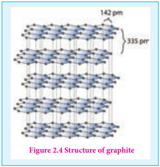
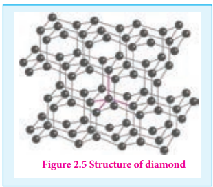
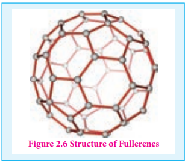
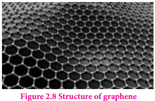
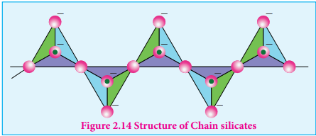
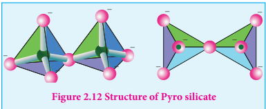
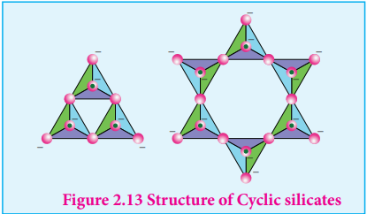
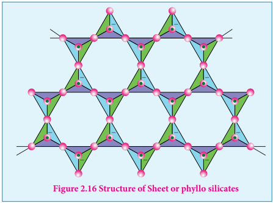
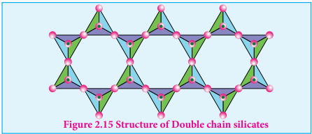

# Occurrence:

Carbon is found in the native form as graphite. Coal, crude oil and carbonate rocks such as calcite, magnesite etc... contains large quantities of carbon in its combined form with other elements. Silicon occurs as silica (sand and quartz crystal). Silicate minerals and clay are other important sources for silicon.

# Physical properties:

Some of the physical properties of the group 14 elements are listed below

**Table 2.4 Physical properties of group 14 elements**

| Property          | Carbon       | Silicon      | Germanium    | Tin          | Lead         |
|-------------------|--------------|--------------|--------------|--------------|--------------|
| Physical state at 293 K | Solid  | Solid        | Solid        | Solid        | Solid        |
| Atomic Number     | 6            | 14           | 32           | 50           | 82           |
| Isotopes          | 12C, 13C, 14C | 28Si, 30Si   | 73Ge, 74Ge   | 120Sn        | 208Pb        |
| Atomic Mass (g.mol-1 at 293 K) | 12.01 | 28.09       | 72.63       | 118.71      | 207.2       |
| Electronic configuration | [He]2s2 2p2 | [Ne]3s2 3p2 | [Ar]3d10 4s2 4p2 | [Kr]4d10 5s2 5p2 | [Xe] 4f14 5d10 6s2 6p2 |
| Atomic radius (Å) | 1.70         | 2.10         | 2.11         | 2.17         | 2.02         |
| Density (g.cm-3 at 293 K) | 3.51     | 2.33         | 5.32         | 7.29         | 11.30        |
| Melting point (K) | Sublimes at 4098 | 1687       | 1211       | 505         | 601         |
| Boiling point (K) | Sublimes at 4098 | 3538         | 3106         | 2859         | 2022         |

# Tendency for catenation

Catenation is an ability of an element to form chain of atoms. The following conditions are necessary for catenation. (i) the valency of element is greater than or equal to two, (ii) element should have an ability to bond with itself (iii) the self bond must be as strong as its bond with other elements (iv) kinetic inertness of catenated compound towards other molecules. Carbon possesses all the above properties and forms a wide range of compounds with itself and with other elements such as H, O, N, S and halogens.

# Allotropes of carbon

Carbon exists in many allotropic forms. Graphite and diamond are the most common allotropes. Other important allotropes are graphene, fullerenes and carbon nanotubes.

**Graphite** is the most stable allotropic form of carbon at normal temperature and pressure. It is soft and conducts electricity. It is composed of flat two dimensional sheets of carbon atoms. Each sheet is a hexagonal net of sp2 hybridised carbon atoms with a C-C bond length of 1.41 Å which is close to the

**Figure 2.4 Structure of graphite**
<!-- pic t a -->

C-C bond distance in benzene (1.40 Å). Each carbon atom forms three σ bonds with three neighbouring carbon atoms using three of its valence electrons and the fourth electron present in the unhybridised p orbital forms a π-bond. These π electrons are delocalised over the entire sheet which is responsible for its electrical conductivity. The successive carbon sheets are held together by weak vander Waals forces. The distance between successive sheet is 3.40 Å. It is used as a lubricant either on its own or as a graphited oil.

Unlike graphite the other allotrope **diamond is very hard. The carbon atoms in** diamond are sp3 hybridised and bonded to four neighbouring carbon atoms by σ bonds with a C-C bond length of 1.54 Å. This results in a tetrahedral arrangement around each carbon atom that extends to the entire lattice as shown in figure 2.5. Since all four valance electrons of carbon are involved in bonding there is no free electrons for conductivity. Being the hardest element, it used for sharpening hard tools, cutting glasses, making bores and rock drilling.

**Fullerenes** are newly synthesised allotropes of carbon. Unlike graphite and diamond, these allotropes are discrete molecules such as C32, C50, C60, C70, C76 etc.. These molecules have cage like structures as shown in the figure. The C60 molecules have a soccer ball like structure and is called buckminster fullerene or buckyballs. It has a fused ring structure consists of 20 six membered rings and 12 five membered rings. Each carbon atom is sp2 hybridised and forms three σ bonds & a delocalised π bond giving aromatic character to these molecules. The C-C bond distance is 1.44 Å and C=C distance 1.38 Å.

Carbon nanotubes, another recently discovered allotropes, have graphite like tubes with fullerene ends. Along the axis, these nanotubes are stronger than steel and conduct electricity. These have many applications in nanoscale electronics, catalysis, polymers and medicine.

**Figure 2.5 Structure of diamond**

**Figure 2.6 Structure of Fullerenes**

**Figure 2.7 Structure of carbon nanotubes**

Another allotrophic form of carbon is graphene. It has a single planar sheet of sp2 hybridised carbon atoms that are densely packed in a honeycomb crystal lattice.

# Carbon monoxide \[CO\]:

**Preparation:**

Carbon monoxide can be prepared by the reaction of carbon with limited amount of oxygen.

<!-- 2C + O2 2CO -->
$\ce{2C + O2 ->2CO}$

On industrial scale carbon monoxide is produced by the reaction of carbon with air. The carbon monoxide formed will contain nitrogen gas also and the mixture of nitrogen and carbon monoxide is called producer gas.

<!-- 2C + O2/N2 (air) 2CO + N2 Producers Gas -->
$\ce{2C + O2/N2 (air) ->2CO + N2 (Producers Gas)}$

The producer gas is then passed through a solution of copper(I)chloride under pressure which results in the formation of CuCl(CO).2H2O. At reduced pressures this solution releases the pure carbon monoxide.

Pure carbon monoxide is prepared by warming methanoic acid with concentrated sulphuric acid which acts as a dehydrating agent.

<!-- HCOOH + H2SO4 CO + H2SO4 . H2O -->
$\ce{HCOOH + H2SO4 ->CO + H2SO4 . H2O}$

**Properties**

It is a colourless, odourless, and poisonous gas. It is slightly soluble in water.

It burns in air with a blue flame forming carbon dioxide. 2CO + O2 2CO2
$\ce{2CO + O2 ->2CO2}$

When carbon monoxide is treated with chlorine in presence of light or charcoal, it forms a poisonous gas carbonyl chloride, which is also known as phosgene. It is used in the synthesis of isocyanates.

CO + Cl2 COCl2
$\ce{2B + N2 ->[{Δ}] 2BN}$

Carbon monoxide acts as a strong reducing agent. 3CO + Fe2O3 2Fe + 3CO2
$\ce{2B + N2 ->[{Δ}] 2BN}$

Under high temperature and pressure a mixture of carbon monoxide and hydrogen (synthetic gas or syn gas) gives methanol.

CO + 2H2 CH3OH
$\ce{2B + N2 ->[{Δ}] 2BN}$

In oxo process, ethene is mixed with carbon monoxide and hydrogen gas to produce propanal.

**Figure 2.8 Structure of graphene**

<!-- CO + C2H4 + H2 CH3CH2CHO -->
$\ce{CO + C2H4 + H2 ->CH3CH2CHO}$

**Fischer Tropsch synthesis:**

The reaction of carbon monoxide with hydrogen at a pressure of less than 50 atm using metal catalysts at 500 - 700 K yields saturated and unsaturated hydrocarbons.

<!-- nCO + (2n+1)H2 CnH(2n+2) + nH2O -->
$\ce{nCO + (2n+1)H2 ->CnH(2n+2) + nH2O}$

<!-- nCO + 2nH2 CnH2n + nH2O -->
$\ce{nCO + 2nH2 ->CnH2n + nH2O}$

Carbon monoxide forms numerous complex compounds with transition metals in which the transition meal is in zero oxidation state. These compounds are obtained by heating the metal with carbon monoxide.

Eg. Nickel tetracarbonyl \[Ni(CO)4\], Iron pentacarbonyl \[Fe(CO)5\], Chromium hexacarbonyl \[Cr(CO)6\].

**Structure:**

It has a linear structure. In carbon monoxide, three electron pairs are shared between carbon and oxygen. The bonding can be explained using molecular orbital theory as discussed in XI standard. The C-O bond distance is 1.128Å. The structure can be considered as the resonance hybrid of the following two canonical forms.

**Figure 2.9 Structure of carbon monoxide**

**Uses of carbon monoxide:**

1. Equimolar mixture of hydrogen and carbon monoxide - water gas and the mixture of carbon monoxide and nitrogen - producer gas are important industrial fuels

2. Carbon monoxide is a good reducing agent and can reduce many metal oxides to metals.

3. Carbon monoixde is an important ligand and forms carbonyl compound with transition metals

# Carbon dioxide:

Carbon dioxide occurs in nature in free state as well as in the combined state. It is a constituent of air (0.03%). It occurs in rock as calcium carbonate and magnesium carbonate.

**Production**

On industrial scale it is produced by burning coke in excess of air.

<!-- C + O2 CO2 ∆H = -394 kJ mol-1 -->
$\ce{C + O2 ->CO2 ∆H = -394 kJ mol-1}$

Calcination of lime produces carbon dioxide as by product. CaCO3 CaO + CO2

Carbon dioxide is prepared in laboratory by the action of dilute hydrochloric acid on metal carbonates.

<!-- CaCO3 + 2HCl CaCl2 + H2O + CO2 -->
$\ce{CaCO3 + 2HCl ->CaCl2 + H2O + CO2}$

**Properties**

It is a colourless, nonflammable gas and is heavier than air. Its critical temperature is 31⁰ C and can be readily liquefied.

Carbon dioxide is a very stable compound. Even at 3100 K only 76 % decomposes to form carbon monoxide and oxygen. At still higher temperature it decomposes into carbon and oxygen.

<!-- CO2 CO + ½O2 3100 K -->
$\ce{CO2 <=>[{3100 K}]CO + ½O2}$

<!-- CO2 C + O2 high temperature -->
$\ce{CO2 <=>[{high temperature}]C + O2}$

**Oxidising behaviour:**

At elevated temperatures, it acts as a strong oxidising agent. For example,

<!-- CO2 + 2Mg 2MgO + C -->
$\ce{CO2 + 2Mg ->2MgO + C}$

**Water gas equilibrium:**

The equilibrium involved in the reaction between carbon dioxide and hydrogen, has many industrial applications and is called water gas equilibrium.

<!-- CO2 + H2 CO + H2O -->
$\ce{CO2 + H2 <=>CO + H2O}$

Water gas

**Acidic behaviour:**

The aqueous solution of carbon dioxide is slightly acidic as it forms carbonic acid.

<!-- CO2 + H2O H2CO3 H+ + HCO3

\- -->
$\ce{CO2 + H2O <=>H2CO3<=>H+ + HCO3}$
**Structure of carbon dioxide**

Carbon dioxide has a linear structure with equal bond distance for the both C-O bonds. In this molecule there is two C-O sigma bond. In addition there is 3c-4e bond covering all the three atoms.

**Figure 2.10 Structure of carbon dixide**

**Uses of carbon dioxide**

1. Carbon dioxide is used to produce an inert atomosphere for chemical processing.

2. Biologically, it is important for photosynthesis.

3. It is also used as fire extinguisher and as a propellent gas.

4. It is used in the production of carbonated beverages and in the production of foam.

# Silicon tetrachloride:

**Preparation:**

Silicon tetrachloride can be prepared by passing dry chlorine over an intimate mixture of silica and carbon by heating to 1675 K in a porcelain tube

<!-- SiO2 + 2C + 2Cl2 SiCl4 + 2CO  -->
$\ce{SiO2 + 2C + 2Cl2 ->SiCl4 + 2CO}$

On commercial scale, reaction of silicon with hydrogen chloride gas occurs above 600 K

<!-- Si + 4HCl SiCl4 + 2H2 -->
$\ce{Si + 4HCl ->SiCl4 + 2H2}$

**Properties:**

Silicon tetrachloride is a colourless fuming liquid and it freezes at -70 ⁰C

In moist air, silicon tetrachloride is hydrolysed with water to give silica and hydrochloric acid.

<!-- SiCl4 + 2H2O 4HCl + SiO2 -->
$\ce{SiCl4 + 2H2O ->4HCl + SiO2}$

When silicon tetrachloride is hydrolysed with moist ether, linear perchloro siloxanes are formed \[Cl-(Si Cl2O)nSiCl3 where n=1-6.

**Alcoholysis**

The chloride ion in silicon tetrachloride can be substituted by nucleophile such as OH, OR, etc.. using suitable reagents. For example, it forms silicic esters with alcohols.

<!-- SiCl4 + 4C2H5OH Si(OC2H5)4 + 4HCl Tetraethoxy silane -->
$\ce{SiCl4 + 4C2H5OH ->[{Tetraethoxy silane}] Si(OC2H5)4 + 4HCl}$

**Ammonialysis.**

Similarly silicon tetrachloride undergoes ammonialysis to form chlorosilazanes.

<!-- 2SiCl4 + NH3 Cl3Si-NH-SiCl3 + 2HCl 330 K Ether -->
$\ce{2SiCl4 + NH3 ->[{330 K}][{Ether}] Cl3Si-NH-SiCl3 + 2HCl}$

**Uses:**

1. Silicon tetrachloride is used in the production of semiconducting silicon.

2. It is used as a starting material in the synthesis of silica gel, silicic esters, a binder for ceramic materials.

# Silcones:
 Silicones or poly siloxanes are organo silicon polymers with general empirical formula

(R2SiO). Since their empirical formula is similar to that of ketone (R2CO), they were named “silicones”. These silicones may be linear or cross linked. Because of their very high thermal stability they are called high –temperature polymers.

**Preparation:**

Generally silicones are prepared by the hydrolysis of dialkyldichlorosilanes (R2SiCl2) or diaryldichlorosilanes Ar2SiCl2, which are prepared by passing vapours of RCl or ArCl over silicon at 570 K with copper as a catalyst.

<!-- 2RCl+ Si R2SiCl2 Cu / 570 K -->
$\ce{2RCl+ Si ->[{Cu / 570 K}] R2SiCl2}$

The hydrolysis of dialkylchloro silanes R2SiCl2 yields to a straight chain polymer which grown from both the sides

<!-- pic t a -->

The hydrolysis of monoalkylchloro silanes RSiCl3 yields to a very complex cross linked polymer.. Linear silicones can be converted into cyclic or ring silicones when water molecules is removed from the terminal –OH groups.

<!-- pic to add -->

**Types of silicones:**

**(i) Liner silicones:**

They are obtained by the hydrolysis and subsequent condensation of dialkyl or diaryl silicon chlorides.

**a) Silicone rubbers: These silicones are bridged together by methylene or similar groups**

**b) Silicone resins: They are obtained by blending silicones with organic resins such as acrylic** esters.

**(ii) Cyclic silicones**

These are obtained by the hydrolysis of R2SiCl2.

**(iii) Cross linked silicones**

They are obtained by hydrolysis of RSiCl3

**Properties**

The extent of cross linking and nature of alkyl group determine the nature of polymer. They range from oily liquids to rubber like solids. All silicones are water repellent. This property arises due to the presence of organic side groups that surrounds the silicon which makes the molecule looks like an alkane. They are also thermal and electrical insulators. Chemically they are inert. Lower silicones are oily liquids whereas higher silicones with long chain structure are waxy solids. The viscosity of silicon oil remains constant and doesn’t change with temperature and they don't thicken during winter

**Uses:**

1. Silicones are used for low temperature lubrication and in vacuum pumps, high temperature oil baths etc...

2. They are used for making water proofing clothes

3. They are used as insulting material in electrical motor and other appliances

4. They are mixed with paints and enamels to make them resistant towards high temperature, sunlight, dampness and chemicals.

# Silicates

The mineral which contains silicon and oxygen in tetrahedral \[SiO 4 \]4- units linked

together in different patterns are called silicates. Nearly 95 % of the earth crust is composed of silicate minerals and silica. The glass and ceramic industries are based on the chemistry silicates.

**Types of Silicates:**

Silicates are classified into various types based on the way in which the tetrahedral units, \[SiO

4 \]4- are linked together.

**Ortho silicates (Neso silicates):** The simplest silicates which contain discrete \[SiO

4 \]4-

tetrahedral units are called ortho silicates or neso silicates.

**Figure 2.11 Structure of Ortho silicates**

**Examples** : Phenacite - Be2SiO4 (Be2+ ions are tetrahedrally surrounded by O2- ions), Olivine - (Fe/Mg)2SiO4 ( Fe2+ and Mg2+ cations are octahedrally surrounded by O2- ions),

**Pyro silicate (or) Soro silicates):** Silicates which contain \[Si2O7\]

6- ions are called pyro silicates (or) Soro silicates. They are formed by joining two \[SiO

4 \]4-tetrahedral

units by sharing one oxygen atom at one corner.(one oxygen is removed while joining). Example : Thortveitite - Sc2Si2O7

**Cyclic silicates (or Ring silicates)**

Silicates which contain (SiO3)n 2n- ions

which are formed by linking three or more tetrahedral SiO4

4- units cyclically are called cyclic silicates. Each silicate unit shares two of its oxygen atoms with other units.

**Example:** Beryl \[Be3Al2 (SiO3)6\] (an aluminosilicate with each aluminium is surrounded by 6 oxygen atoms octahedrally)

**Inosilicates :**

Silicates which contain 'n' number of silicate units linked by sharing two or more oxygen atoms are called inosilicates. They are further classified as chain silicates and double chain silicates.

**Chain silicates (or pyroxenes): These** silicates contain \[(SiO3)

n\]2n- ions formed by linking ‘n’ number of tetrahedral \[SiO

4 \]4-units

linearly. Each silicate unit shares two of its oxygen atoms with other units.

**Example:** Spodumene - LiAl(SiO3)2.

**Double chain silicates (or amphiboles): These silicates contains \[Si4O11\]n** 6n- ions. In these

silicates there are two different types of tetrahedra : (i) Those sharing 3 vertices (ii) those sharing only 2 vertices.

**Figure 2.14 Structure of Chain silicates**

**Figure 2.12 Structure of Pyro silicate**

**Figure 2.13 Structure of Cyclic silicates**

**Examples:**

1) Asbestos: These are fibrous and non- combustible silicates. Therefore they are used for thermal insulation material, brake linings, construction material and filters. Asbestos being carcinogenic silicates, their applications are restricted.

**Sheet or phyllo silicates**

Silicates which contain (Si2O5)n

2n- are called sheet or phyllo silicates. In these, Each \[ S i O

4 \] 4 - t e t r a h e d r o n

unit shares three oxygen atoms with others and thus by forming two- dimensional sheets. These sheets silicates form layered structures in which silicate sheets are stacked over each other. The attractive forces between these layers are very weak, hence they can be cleaved easily just like graphite.

**Example:** Talc, Mica etc...

**Three dimensional silicates (or tecto silicates):**

Silicates in which all the oxygen atoms of \[SiO 4 \]4-tetrahedra are shared with other

tetrahedra to form three-dimensional network are called three dimensional or tecto silicates. They have general formula (SiO2)n .

**Examples:** Quartz

These tecto silicates can be converted into Three dimensional aluminosilicates by replacing \[SiO4\]

4- units by \[AlO4\] 5- units. E.g. Feldspar, Zeolites etc.,

# Zeolites:

Zeolites are three-dimensional crystalline solids containing aluminium, silicon, and oxygen in their regular three dimensional framework. They are hydrated sodium alumino silicates with general formula Na2O.(Al2O3).x(SiO2).yH2O (x=2 to 10; y=2 to 6).

**Figure 2.16 Structure of Sheet or phyllo silicates**

**Figure 2.15 Structure of Double chain silicates**

Zeolites have porous structure in which the monovalent sodium ions and water molecules are loosely held. The Si and Al atoms are tetrahedrally coordinated with each other through shared oxygen atoms. Zeolites are similar to clay minerals but they differ in their crystalline structure.

Zeolites have a three dimensional crystalline structure looks like a honeycomb consisting of a network of interconnected tunnels and cages. Water molecules moves freely in and out of these pores but the zeolite framework remains rigid. Another special aspect of this structure is that the pore/channel sizes are nearly uniform, allowing the crystal to act as a molecular sieve. We have already discussed in XI standard, the removal of permanent hardness of water using zeolites.

**Boron Neutron Capture Therapy:**

The affinity of Boron-10 for neutrons is the basis of a technique known as boron neutron capture therapy (BNCT) for treating patients suffering from brain tumours.

It is based on the nuclear reaction that occurs when boron-10 is irradiated with low-energy thermal neutrons to give high linear energy α particles and a Li particle.

Boron compounds are injected into a patient with a brain tumour and the compounds collect preferentially in the tumour. The tumour area is then irradiated with thermal neutrons and results in the release of an alpha particle that damages the tissue in the tumour each time a boron-10 nucleus captures a neutron. In this way damage can be limited preferentially to the tumour, leaving the normal brain tissue less affected. BNCT has also been studied as a treatment for several other tumours of the head and neck, the breast, the prostate, the bladder, andthe liver.
<!-- 
**Summary**

„ The elements in which their last electron enters the 'p' orbital, constitute the p-block elements.

„ The p-block elements have a general electronic configuration of ns2, np1-6. The elements of each group have similar outer shell electronic configuration and differ only in the value of n (principal quantum number).

„ Generally on descending a group the ionisation energy decreases and hence the metallic character increases.

„ The ionisation enthalpy of elements in successive groups is higher than the corresponding elements of the previous group as expected.

„ As we move down the 13th group, the electronegativity first decreases from boron to aluminium and then marginally increases.

XII\_U2-P-Block.indd 51 2/19/2020 4:39:00 PM

www.tntextbooks.in

  

52

„ In p-block elements, the first member of each group differs from the other elements of the corresponding group.

„ In heavier post-transition metals, the outer s electrons (ns) have a tendency to remain inert and show reluctance to take part in the bonding, which is known as inert pair effect.

„ Some elements exist in more than one crystalline or molecular forms in the same physical state. For example, carbon exists as diamond and graphite. This phenomenon is called allothropism

„ Borax is a sodium salt of tetraboric acid. It is obtained from colemanite ore by boiling its solution with sodium carbonate.

„ Boric acid can be extracted from borax and colemanite.

„ Boric acid has a two dimensional layered structure.

„ The name alum is given to the double salt of potassium aluminium sulphate \[K2SO4. Al2(SO4)3.24.H2O\].

„ Carbon is found in the native form as graphite.

„ Silicon occurs as silica (sand and quartz crystal). Silicate minerals and clay are other important sources for silicon.

„ Catenation is an ability of an element to form chain of atoms

„ Carbon nanotubes, another recently discovered allotropes, have graphite like tubes with fullerene ends.

„ Silicones or poly siloxanes are organo silicon polymers with general empirical formula (R2SiO). Because of their very high thermal stability they are called high –temperature polymers.

„ The mineral which contains silicon and oxygen in tetrahedral \[SiO 4 \]4- units linked

together in different patterns are called silicates.

„ Types of Silicates:

▶ **Ortho silicates (Neso silicates), Pyro silicate (or) Soro silicates),** Cyclic silicates (or Ring silicates)

▶ Inosilicates : **Chain silicates (or pyroxenes), Double chain silicates (or amphiboles):**

▶ Sheet or phyllo silicates

▶ Three dimensional silicates (or tecto silicates)

„ Zeolites are three-dimensional crystalline solids containing aluminium, silicon, and oxygen in their regular three dimensional framework.

„ zeolites act as a molecular sieve for the removal of permanent hardness of water

XII\_U2-P-Block.indd 52 2/19/2020 4:39:01 PM

www.tntextbooks.in

  

53

**EVALUATION**

**Choose the correct answer:**

1\. An aqueous solution of borax is

a) neutral b) acidic c) basic d) amphoteric

2\. Boric acid is an acid because its molecule (NEET)

a) contains replaceable H+ ion

b) gives up a proton

c) combines with proton to form water molecule

d) accepts OH- from water ,releasing proton.

3\. Which among the following is not a borane?

a) B H2 6 b) B H3 6 c) B H4 10 d) none of these

4\. Which of the following metals has the largest abundance in the earth’s crust?

a) Aluminium b) calcium c) Magnesium d) sodium

5\. In diborane, the number of electrons that accounts for banana bonds is

a) six b) two c) four d) three

6\. The element that does not show catenation among the following p-block elements is

a) Carbon b) silicon c) Lead d) germanium

7\. Carbon atoms in fullerene with formula C60 have

a) sp3 hybridised b) sp hybridised

c) sp2 hybridised d) partially sp2 and partially sp3 hybridised

8\. Oxidation state of carbon in its hydrides

a) +4 b) -4 c) +3 d) +2

9\. The basic structural unit of silicates is (NEET)

a) SiO3( ) −2 b) SiO4( ) −2 c) SiO( )− d) SiO4( ) −4

10\. The repeating unit in silicone is

a) SiO2 b) Si

R

O

R

c) Si

R

OOR d) Si

R

O O R

XII\_U2-P-Block.indd 53 2/19/2020 4:39:02 PM

www.tntextbooks.in

  

54

11\. Which of these is not a monomer for a high molecular mass silicone polymer?

a) Me3SiCl b) PhSiCl3 c) MeSiCl3 d) Me2SiCl2

12\. Which of the following is not sp2 hybridised?

a) Graphite b) graphene c) Fullerene d) dry ice

13\. The geometry at which carbon atom in diamond are bonded to each other is

a) Tetrahedral b) hexagonal c) Octahedral d) none of these

14\. Which of the following statements is not correct?

a) Beryl is a cyclic silicate

b) Mg2SiO4 is an orthosilicate

c) SiO4 4−

is the basic structural unit of silicates

d) Feldspar is not aluminosilicate

15\. Match items in column - I with the items of column – II and assign the correct code.

**Column-I Column-II**

A Borazole 1 B(OH)3

B Boric acid 2 B3N3H6

C Quartz 3 Na2\[B4O5(OH)4\] 8H2O

D Borax 4 SiO2

16\. Duralumin is an alloy of

a) Cu,Mn b) Cu,Al,Mg c) Al,Mn d) Al,Cu,Mn,Mg

17\. The compound that is used in nuclear reactors as protective shields and control rods is

a) Metal borides b) metal oxides c) Metal carbonates d) metal carbide

18\. The stability of +1 oxidation state increases in the sequence

a) Al < Ga < In < Tl b) Tl < In < Ga < Al

c) In < Tl < Ga < Al d) Ga< In < Al < Tl

**Answer the following questions:**

1\. Write a short note on anamolous properties of the first element of p-block. 2. Describe briefly allotropism in p- block elements with specific reference to carbon. 3. Give the uses of Borax. 4. What is catenation ? describe briefly the catenation property of carbon. 5. Write a note on Fisher tropsch synthesis.

A B C D

(a) 2 1 4 3

(b) 1 2 4 3

(c) 1 2 4 3

(d) None of these

XII\_U2-P-Block.indd 54 2/19/2020 4:39:03 PM

www.tntextbooks.in

| A |B |C |D |
|------|------|------|------|------|
| (a) |2 |1 |4 |3 |
| (b) |1 |2 |4 |3 |
| (c) |1 |2 |4 |3 |
| (d) |None of these |

| C olumn-I |C olumn-II |
|------|------|------|------|
| A |B orazole |1 |B(OH)3 |
| B |B oric acid |2 |B N H3 3 6 |
| C |Quartz |3 |Na [B O (OH) ] 8H O2 4 5 4 2 |
| D |B orax |4 |SiO2 |
  

55

6\. Give the structure of CO and CO2. 7. Give the uses of silicones. 8. Describe the structure of diborane. 9. Write a short note on hydroboration. 10. Give one example for each of the following

(i) icosogens (ii) tetragen (iii) prictogen (iv) chalcogen

11\. Write a note on metallic nature of p-block elements.

12\. Complete the following reactions _a b c_

.

. .

B OH +NH Na B O + H SO H O B H + 2NaOH

3 3

2 4 2 2

2

( ) → + →

\+ 7 4

6 2H O B H + CH OH BF + 9 H O HCOOH + H SO

2

2 6 3

3 2

2

→ →

→ _d e f_

. . . 4

4 3

4 2 5

SiCl + NH SiCl + C H OH

B + NaOH

→ →

→ →

_g h i_

. .

. _j_. H B O2 4 7

Red hot →

13\. How will you identify borate radical?

14\. Write a note on zeolites.

15\. How will you convert boric acid to boron nitride?

16\. A hydride of 2nd period alkali metal (A) on reaction with compound of Boron (B) to give a reducing agent (C). identify A, B and C.

17\. A double salt which contains fourth period alkali metal (A) on heating at 500K gives (B). aqueous solution of (B) gives white precipitate with BaCl2 and gives a red colour compound with alizarin. Identify A and B.

18\. CO is a reducing agent. justify with an example.

XII\_U2-P-Block.indd 55 2/19/2020 4:39:03 PM

www.tntextbooks.in
 -->

