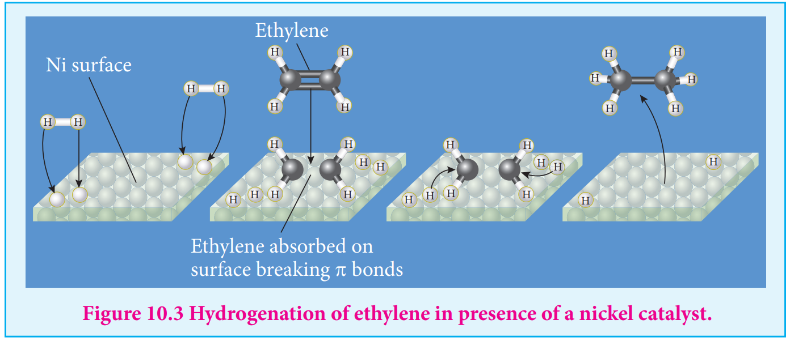
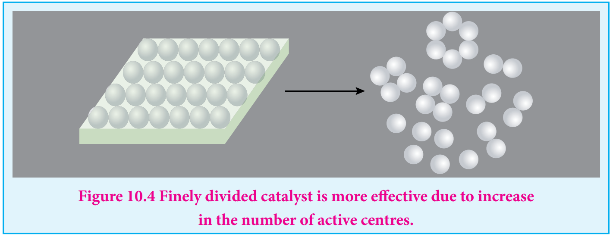

In 1836 Berzelius identified certain substances loosen the bond in the reacting molecules and increased the rate of the reaction. But he also found these substances didn’t undergo any change chemically. In order to indicate the property, he gave them the name catalyst. (In greek, kata-wholly, lein-to loosen).

Later it was identified that there were many substances which retarded the speed of a reaction.

Hence a catalyst is defined as a substance which alters the rate of chemical reaction without itself undergoing chemical change. The phenomenon which involves the action of a catalyst is called catalysis.

**Positive and negative catalysis:**

In positive catalysis, the rate of a reaction is increased by the presence of catalyst but in negative catalysis, the rate of reaction is decreased by the presence of a catalyst.

The two main types of catalysis (i) Homogeneous catalysis and (ii) Heterogeneous catalysis

**Homogeneous catalysis**

In a homogeneous catalysed reaction, the reactants, products and catalyst are present in the same phase.

**Illustration (1):**

2SO2(g)+O2(g)+[NO](g) → 2SO3(g)+[NO](g)

In this reaction the catalyst NO, reactants, SO2 and O2 , and product, SO3 are present in the gaseous form.

**Illustration (2):**

In the decomposition of acetaldehyde by I2 catalyst, the reactants and products are all present in the vapour phase.

CH3CHO(g)+\[I2\](g) → CH4(g)+CO(g)+\[I2\](g)

Let us consider some examples in which the reactants, products and catalyst are present in aqueous solution.

(1) Hydrolysis of cane sugar with a mineral acid as catalyst


\underset{\text{Source}}{C_{12}H_{22}O_{11_{(l)}}} + H_2O_{(l)} \xrightarrow{H_2SO_{4_{(l)}}} \underset{\text{Glucose}}{C_{6}H_{12}O_{6_{(l)}}} + \underset{\text{Fructose}}{C_{6}H_{12}O_{6_{(l)}}}


(2) Ester hydrolysis with acid or alkali as catalyst


\underset{\text{Ethyl acetate}}{CH_{3}COOC_{2}H_{5_{(l)}}} + H_2O_{(l)} \xrightarrow{H_2SO_{4_{(l)}}} \underset{\text{acetic acid}}{CH_{3}COOH_{\ _{(l)}}} +\underset{\text{ethyl alcohol}}{C_2H_2OH_{\ _{(l)}}} 


**Heterogeneous catalysis**

In a reaction, the catalyst is present in a different phase i.e. it is not present in the same phase as that of reactants or products. This is generally referred as contact catalysis and the catalyst present is in the form of finely divided metal or as gauze

**Illustration**

1. In the manufacture of sulphuric acid by contact process SO3 is prepared by the action of SO2 and O2 in the presence of Pt or V2O5 as a catalyst.


2SO_{2^{(g)}} + O_{2^{(g)}} \xrightarrow{Pt_{(s)}\ or\ V_2O_{5(s)}} 2SO_{3^{(g)}}


2. In the Haber’s process for the manufacture of ammonia, iron is used as a catalyst for the reaction between Hydrogen and Nitrogen.


N_{2^{(g)}} + 3H_{2^{(g)}} \xrightarrow{Fe_{(s)}} 2NH_{3^{(g)}}


3. Oxidation of ammonia is carried out in presence of platinum gauze


4NH_{2{(g)}} + 5O_{2(g)} \xrightarrow{Pt_{(s)}} 4NO_{2{(g)}}+6H_2O_{(g)}


4. The hydrogenation of unsaturated organic compounds is carried out using finely divided nickel as a catalyst.


CH_2=CH_{2{(g)}} + H_{2(g)} \xrightarrow{Ni_{(s)}} CH_3-CH_{3(g)}


5. Decomposition of H2O2 occurs in the presence of the Pt catalyst


2H_2O_{2(l)} \xrightarrow{Pt_{(s)}} 2H_2O_{(l)}+O_{2(g)}


6. In the presence of anhydrous AlCl3, benzene reacts with ethanoyl chloride to produce acetophenone

# Characteristics of catalysts

1. For a chemical reaction, catalyst is needed in very small quantity. Generally, a pinch of catalyst is enough for a reaction in bulk.

2. There may be some physical changes, but the catalyst remains unchanged in mass and chemical composition in a chemical reaction.

3. A catalyst itself cannot initiate a reaction. It means it can not start a reaction which is not taking place. But, if the reaction is taking place in a slow rate it can increase its rate.

4. A solid catalyst will be more effective if it is taken in a finely divided form. 5. A catalyst can catalyse a particular type of reaction, hence they are said to be specific in nature.

6. In an equilibrium reaction, presence of catalyst reduces the time for attainment of equilibrium and hence it does not affect the position of equilibrium and the value of equilibrium constant.

7. A catalyst is highly effective at a particular temperature called as optimum temperature. 

8. Presence of a catalyst generally does not change the nature of products For example. 2SO2 +O2 → 2SO3

This reaction is slow in the absence of a catalyst, but fast in the presence of Pt catalyst

**Promoters and catalyst poison**

In a catalysed reaction the presence of a certain substance increases the activity of a catalyst. Such a substance is called a promoter.

For example in the Haber’s process of manufacture of ammonia, the activity of the iron catalyst is increased by the presence of molybdenum. Hence molybdenum is called a promoter. In the same way Al2O3 can also be used as a promoter to increase the activity of the iron catalyst.

On the other hand, certain substances when added to a catalysed reaction decreases or completely destroys the activity of catalyst and they are often known as catalytic poisons.

**Few examples,**

In the reaction, 2SO2 + O2 → 2SO3 with a Pt catalyst, the poison is As2O3

i.e., As2O3 destroys the activity of Pt.As2O3 blocks the activity of the catalyst. So, the activity is lost.

In the Haber’s process of the manufacture of ammonia, the Fe catalyst is poisoned by the presence of H2S.

In the reaction, 2H2+O2 → 2H2O,

CO acts as a catalytic poison for Pt - catalyst

**Auto catalysis**

In certain reactions one of the products formed acts as a catalyst to the reaction. Initially the rate of reaction will be very slow but with the increase in time the rate of reaction increases.

Auto catalysis is observed in the following reactions.

CH3COOC2H5 +H2O → CH3COOH+C2H5OH

Acetic acid acts as the autocatalyst

2AsH3 → 2As+3H2

Arsenic acts as an autocatalyst

**Negative Catalysis**

In certain reactions, presence of certain substances, decreases the rate of the reaction. Ethanol is a negative catalyst for the following reaction.

1. 4CHCl3 +3O2 → 4COCl2+2H2O+2Cl2

Ethanol decreases the rate of the reaction

2. 2H2O2 → 2H2O+O2

In the decomposition of hydrogen peroxide, dilute acid or glycerol acts as a negative catalyst.

# Theories of Catalysis

For a chemical reaction to occur, the reactants are to be activated to form the activated complex. The energy required for the reactants to reach the activated complex is called the activation energy. The activation energy can be decreased by increasing the reaction temperature. In the presence of a catalyst, the reactants are activated at reduced temperatures in otherwords, the activation energy is lowered. The catalyst adsorbs the reactants activates them by weakening the bonds and allows them to react to form the products.

As activation energy is lowered in presence of a catalyst, more molecules take part in the reaction and hence the rate of the reaction increases.

The action of catalysis in chemical reactions is explained mainly by two important theories. They are

1. the intermediate compound formation theory

2. the adsorption theory.

**The intermediate compound formation theory**

A catalyst acts by providing a new path with low energy of activation. In homogeneous catalysed reactions a catalyst may combine with one or more reactant to form an intermediate which reacts with other reactant or decompose to give products and the catalyst is regenerated.

Consider the reactions:

A+B → AB (1)

A+C → AC (intermediate) (2)

C is the catalyst

AC+B → AB+C (3)

Activation energies for the reactions (2) and (3) are lowered compared to that of (1). Hence the formation and decomposition of the intermediate accelerate the rate of the reaction.

**Example 1** The mechanism of Fridel crafts reaction is given below



C_6H_6+CH_3Cl
\xrightarrow{\underset{\text{anhydrous}}{AlCl_3}} 

C_6H_5CH_3+HCl



The action of catalyst is explained as follows

CH3Cl+AlCl3 → \[CH3\]+\[AlCl4\]-

It is an intermediate.

C6H6+\[CH3+\]\[AlCl4\]- → C6H5CH3+AlCl3+HCL

**Example 2**

Thermal decomposition of KClO3 in presence of MnO2 proceeds as follows.

Steps in the reaction 2KClO3 → 2KCl+3O2 can be given as

2KClO3+6MnO2 → 6MnO3 +2KCl

It is an intermediate.

6MnO3 → 6MnO2+3O2

**Example 3:**

Formation of water due to the reaction of H2 and O2 in the presence of Cu proceeds as follows. Steps in the reaction H2+½O2 → H2O can be given as

2Cu+½O2 → Cu2O

It is an intermediate.

Cu2O → H2O+2Cu

**Example 4:**

Oxidation of HCl by air in presence of CuCl2 proceeds as follows. Steps in the reaction 4HCl+O2 → 2H2O+2Cl2 can be given as

2CuCl2+O2 → Cl2+Cu2Cl2

2Cu2Cl2+O2 → 2Cl2+Cu2Cl2

It is an intermediate.

2Cu2OCl2+O2 → 2H2O+4CuCl2

This theory describes

1. the specificity of a catalyst and

2. the increase in the rate of the reaction with increase in the concentration of a catalyst.

**Limitations**

1. The intermediate compound theory fails to explain the action of catalytic poison and activators (promoters).

2. This theory is unable to explain the mechanism of heterogeneous catalysed reactions.

**2. Adsorption theory**

Langmuir explained the action of catalyst in heterogeneous catalysed reactions based on adsorption. The reactant molecules are adsorbed on the catalyst surfaces, so this can also be called as contact catalysis.

According to this theory, the reactants are adsorbed on the catalyst surface to form an activated complex which subsequently decomposes and gives the product.

The various steps involved in a heterogeneous catalysed reaction are given as follows:

1. Reactant molecules diffuse from bulk to the catalyst surface.

2. The reactant molecules are adsorbed on the surface of the catalyst. 3. The adsorbed reactant molecules are activated and form activated complex which is decomposed to form the products.

4. The product molecules are desorbed.

5. The product diffuse away from the surface of the catalyst.

**Active centres**

The surface of a catalyst is not smooth. It bears steps, cracks and corners. Hence the atoms on such locations of the surface are co-ordinatively unsaturated. So, they have much residual force of attraction. Such sites are called active centres. So, the surface carries high surface free energy.

The presence of such active centres increases the rate of reaction by adsorbing and activating the reactants.

The adsorption theory explains the following

i. Increase in the surface area of metals and metal oxides by reducing the particle size increases acting of the catalyst and hence the rate of the reaction.

ii. The action of catalytic poison occurs when the poison blocks the active centres of the catalyst.

iii. A promoter or activator increases the number of active centres on the surfaces.
