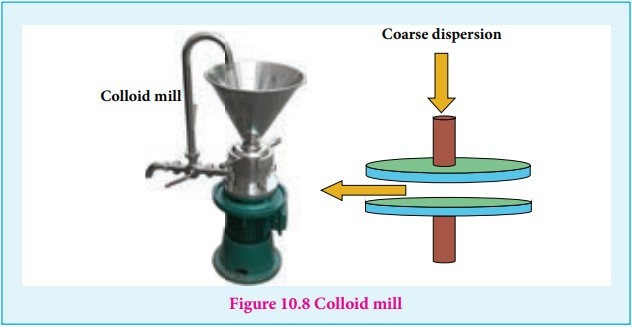
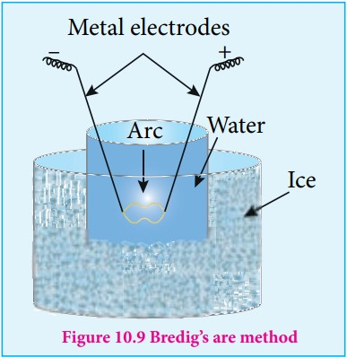
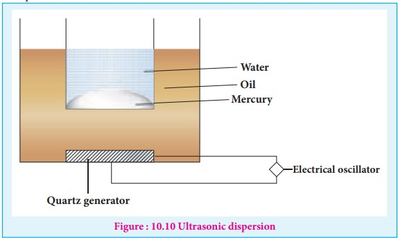
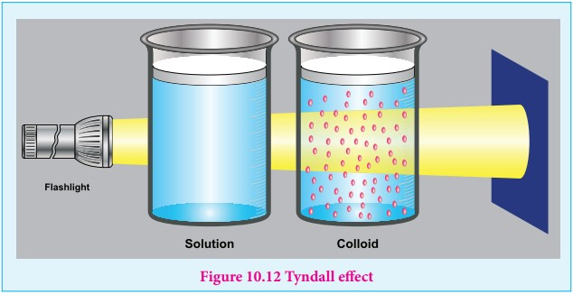
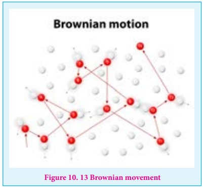
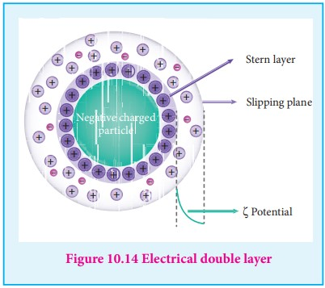
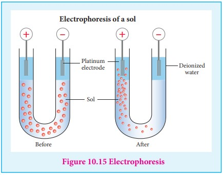
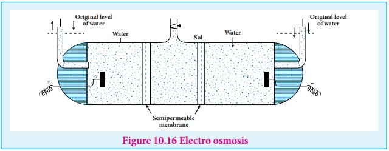

# Colloid, Dispersion phase and dispersion medium

Origin of study of colloid starts with Thomas Graham who observed diffusion of that a solution of sugar, urea or sodium chloride through a membrane but not glue, gelatine or gum. He called the former substances as crystalloids and the latter as colloids ( In Greek, kola as gum, eidos-like).

Later it was realised that any substance can be converted into a colloid by reducing its particle size to 1-200nm.

Hence, colloid is a homogeneous mixture of two substances in which one substance (smaller proportion) is dispersed in another substance( large proportion).

In a colloid, the substance present in larger amount is called dispersing medium and the substance present in less amount is called dispersed phase.

# Classifications of Colloidal solution

Probably the most important colloidal systems have dispersed phase as solid and the dispersion medium as liquid.

If the dispersion medium considered is water, then the colloids are referred as hydrosols or aquasols.

If the dispersion medium is an alcohol, the colloid is termed as alcosol, and if benzene is the dispersion medium, it is called as benzosol.

One more type of classification is based on the forces acting between the dispersal phase and dispersion medium.

In lyophillic colloids definite attractive force or affinity exists between dispersion medium and dispersed phase. Examples: sols of protein and starch. They are more stable and will not get precipitated easily. They can be brought back to colloidal solution even after the precipitation by addition of the dispersion medium.

In a lyophobic colloids, no attractive force exists between the dispersed phase and dispersion medium. They are less stable and precipitated readily, but can not be produced again by just adding the dispersion medium. They themselves undergo coagulation after a span of characteristic life time.

They are called irreversible sols

examples: sols of gold, silver, platinum and copper.

The following table lists the types of colloids based on the physical states of dispersed phase and dispersion medium.

**Classification of colloids based on the physical state of dispersed phase and dispersion medium.**

| S.No. | Dispersion medium | Dispersed phase | Name of the colloid | Examples                                         |
| ----- | ----------------- | --------------- | ------------------- | ------------------------------------------------ |
| 1.    | Gas               | Liquid          | Liquid Aerosol      | FogAerosol spray                                 |
| 2.    | Gas               | Solid           | Solid Aerosol       | Smoke, Air pollutants like fumes, dust.          |
| 3.    | Liquid            | Gas             | Foam                | Whipped cream, Shaving cream, Soda water, Froth. |
| 4.    | Liquid            | Liquid          | Emulsion            | Milk, Cream, Mayonnaise                          |
| 5.    | Liquid            | Solid           | Sol                 | Inks, Paints, colloidal gold.                    |

# Preparation of Colloids

Many lyophillic substances are made in their colloidal form by warming with water. Rubber forms colloidal solution with benzene. Soap spontaneously forms a colloidal solution by just mixing with water.

In general, colloidal are prepared by the following methods.

1. Dispersion methods: In this method larger particles are broken to colloidal dimension.
2. Condensation method: In this method, smaller atom or molecules are converted into larger colloidal sized particles.

**1) Dispersion methods**

**(i) Mechanical Dispersion:**

Using a colloid mill, the solid is ground to colloidal dimension. The colloid mill consists of two metal plates rotating in opposite direction at very high speed of nearly 7000 revolution / minute.



The colloidal particles of required colloidal size is obtained by adjusting the distance between two plates.

By this method, colloidal solutions of ink and graphite are prepared.

**(ii) Electro Dispersion:**



A brown colloidal solution of platinum was first prepared by George Bredig in 1898. An electrical arc is struck between electrodes dispersed in water surrounded by ice. When a current of 1 amp /100 V is passed an arc produced forms vapours of metal which immediately condense to form colloidal solution. By this method colloidal solution of many metals like copper, silver, gold, platinum, etc. can be prepared Alkali hydroxide is added as an stabilising agent for the colloidal solution.

Svedberg modified this method for the preparation of non aqueous inflammable liquids like pentane, ether and benzene, etc using high frequency alternating current which prevents the decomposition of liquid.

**(iii) Ultrasonic dispersion**

Sound waves of frequency more than 20kHz (audible limit) could cause transformation of coarse suspension to colloidal dimensions.



Claus obtained mercury sol by subjecting mercury to sufficiently high frequency ultrasonic vibrations.

The ultrasonic vibrations produced by generator spread the oil and transfer the vibration to the vessel with mercury in water.

**(iv) Peptisation:**

By addition of suitable electrolytes, precipitated particles can be brought into colloidal

state. The process is termed as peptisation and the electrolyte added is called peptising or dispersing agent.



\underset{\text{particitpate}}{AgCl} \xrightarrow{HCl} \underset{\text{Colloid}}{AgCl}



**2) Condensation Methods:**

When the substance for colloidal particle is present as small sized particle, molecule or ion, they are brought to the colloidal dimension by condensation methods. Here care should be taken to produce the particle with colloidal size otherwise precipitation will occur. Various chemical methods for the formation of colloidal particles.

**(1) Oxidation:**

Sols of some non metals are prepared by this method.

(a) When hydroiodic acid is treated with iodic acid, I2 sol is obtained.

HIO<sub>3</sub> +5HI → 3H<sub>2</sub>O+I<sub>2</sub>(Sol)

(b) When O2 is passed through H2Se, a sol of selenium is obtained.

H<sub>2</sub>Se +O<sub>2</sub> → 2H<sub>2</sub>O+Se(Sol)

**(2) Reduction:**

Many organic reagents like phenyl hydrazine, formaldehyde, etc are used for the formation
of sols. For example: Gold sol is prepared by reduction of auric chloride using formaldehyde.

2AuCl<sub>3</sub> +3HCHO+3H<sub>2</sub>O → 2Au(sol)+6HCl+3HCOOH

**(3) Hydrolysis** Sols of hydroxides of metals like chromium and aluminium can be produced by this method.

**For Example,**

FeCl<sub>3</sub>+3H<sub>2</sub>O → Fe(OH)<sub>3</sub> +3HCl

**(4) Double decomposition**

For the preparation of water insoluble sols this method can be used. When hydrogen sulphide gas is passed through a solution of arsenic oxide, a yellow coloured arsenic sulphide is obtained as a colloidal solution.

As<sub>2</sub>O<sub>3</sub>+3H<sub>2</sub>S → As<sub>2</sub>S<sub>3</sub>+3H<sub>2</sub>O

**(5) Decomposition**

When few drops of an acid is added to a dilute solution of sodium thiosulphate, the insoluble free sulphur produced by decomposition of sodium thiosulphate accumulates into small, clusters which impart various colours blue, yellow and even red to the system depending on their growth within the size of colloidal dimensions.

S<sub>2</sub>O<sub>3</sub><sup>2-</sup>+2H<sup>+</sup> → S+H<sub>2</sub>O+SO<sub>2</sub>

**3) By exchange of solvent:**

Colloidal solution of few substances like phosphorous or sulphur is obtained by preparing the solutions in alcohol and pouring them into water. As they are insoluble in water, they form colloidal solution.

P in alcohol + water → P<sub>sol</sub>.

### Purification of colloids

The colloidal solutions due to their different methods of preparation may contain impurities. If they are not removed, they may destablise and precipitate the colloidal solution. This is called coagulation. Hence the impurities mainly electrolytes should be removed to increase the stabilisation of colloid. Purification of colloidal solution can be done by the following methods.

(1) Dialysis (2) Electrodialysis (3) Ultrafilteration.

**(1) Dialysis**

In 1861, T. Graham separated the electrolyte from a colloid using a semipermeable membrane (dialyser). In this method, the colloidal solution is taken in a bag made up of semipermeable membrane. It is suspended in a trough of flowing water, the electrolytes diffuse out of the membrane and they are carried away by water.

```
Do you Know? Kidney malfunction results in the building up of electrolyte concentration within the blood to toxic levels.
 In the Dialysis, recycling of patient’s blood is done through considerable length of seimpermeable tube in an isotonic saline solution.
```

**2) Electrodialysis**

The presence of electric field increases the speed of removal of electrolytes from colloidal solution. The colloidal solution containing an electrolyte as impurity is placed between two dialysing membranes enclosed into two compartments filled with water. When current is passed, the impurities pass into water compartment and get removed periodically. This process is faster than dialysis, as the rate of diffusion of electrolytes is increased by the application of electricity.


**3) Ultrafiltration**

The pores of ordinary filter papers permit the passage of colloidal solutions. In ultra filtrations, the membranes are made by using collodion cellophane or visiking. When a colloidal solution is filtered using such a filter,
colloidal particles are separated on the filter and the impurities are removed as washings. This process is quickened by application of pressure. The separation of sol particles from electrolyte by filteration through an ultrafilter is called ultrafiltration. Collodion is 4% solution of nitrocellulose in a mixture of alcohol and water.

# Purification of colloids

The colloidal solutions due to their different methods of preparation may contain impurities. If they are not removed, they may destablise and precipitate the colloidal solution. This is called coagulation. Hence the impurities mainly electrolytes should be removed to increase the stabilisation of colloid. Purification of colloidal solution can be done by the following methods.

(i) Dialysis (ii) Electrodialysis (iii) Ultrafilteration.

**(i) Dialysis**

In 1861, T. Graham separated the electrolyte from a colloid using a semipermeable membrane (dialyser). In this method, the colloidal solution is taken in a bag made up of semipermeable membrane. It is suspended in a trough of flowing water, the electrolytes diffuse out of the membrane and they are carried away by water.

<blockquote>
**Do you Know?** Kidney malfunction results in the building up of electrolyte concentration within the blood to toxic levels.

In the Dialysis, recycling of patient’s blood is done through considerable length of seimpermeable tube in an isotonic saline solution.

</blockquote>

**ii) Electrodialysis**


The presence of electric field increases the speed of removal of electrolytes from colloidal solution. The colloidal solution containing an electrolyte as impurity is placed between two dialysing membranes enclosed into two compartments filled with water. When current is passed, the impurities pass into water compartment and get removed periodically. This process is faster than dialysis, as the rate of diffusion of electrolytes is increased by the application of electricity.

**iii) Ultrafiltration**

The pores of ordinary filter papers permit the passage of colloidal solutions. In ultra filtrations, the membranes are made by using collodion cellophane or visiking. When a colloidal solution is filtered using such a filter, colloidal particles are separated on the filter and the impurities are removed as washings. This process is quickened by application of pressure. The separation of sol particles from electrolyte by filteration through an ultrafilter is called ultrafiltration. Collodion is 4% solution of nitrocellulose in a mixture of alcohol and water.

# Properties of Colloids

**1) Colour:**

The colour of a sol is not always the same as the colour of the substance in the bulk. For example bluish tinge is given by diluted milk in reflected light and reddish tinge in transmitted light.

Colour of the sol, generally depends on the following factors.

1. Method of preparation
2. Wavelength of source of light.
3. Size and shape of colloidal particle
4. whether the observer views the reflected light or transmitted light.

**2) Size:** The size of colloidal particles ranges from 1nm (10-9m) to 1000 nm (10-6m) diameter.

**3) Colloidal solutions are heterogeneous in nature having two distinct phases.**

Though experiments like dialysis, ultrafiltration and ultracentrifuging clearly show the heterogeneous nature in the recent times colloidal solution are considered as border line cases.

**4) Filtrability:**

As the size of pores in ordinary filter paper are large the colloidal particles easily pass through the ordinary filter papers.

**5) Non-Setting nature**

Colloidal solutions are quite stable i.e. they are not affected by gravity.

**6) Concentration and density**

When the colloidal solution is dilute, it is stable. When the volume of medium is decreased coagulation occurs. Generally, density of sol decreases with decrease in the concentration.

**7) Diffusability**

Unlike true solution, colloids diffuse less readily through membranes.

**8) Colligative properties**

The colloidal solutions show colligative properties i.e. elevation of boiling point, depression in freezing point and osmotic pressure. Measurements of osmotic pressure is used to find molecular weight of colloidal particle.

**9) Shape of colloidal particles**

It is very interesting to know the various shapes of colloidal particles. Here are some examples

| C olloidal Particles         | Shapes             |
| ---------------------------- | ------------------ |
| As S23                       | Spherical          |
| (blue gold sol)Fe (OH) sol3  | Disc or plate like |
| WO sol (tungstic acid sol)35 | Rod like           |

**10) Optical property**

Colloids have optical property. When a homogeneous solution is seen in the direction of light, it appears clear but it appears dark, in a perpendicular direction.



But when light passes through colloidal solution, it is scattered in all directions. This effect was first observed by Faraday, but investigations are made by Tyndall in detail, hence called as Tyndall effect.

The colloidal particles absorb a portion of light and the remaining portion is scattered from the surface of the colloid. Hence the path of light is made clear.

**11) Kinetic property**

Robert Brown observed that when the pollen grains suspended in water were viewed through ultra microscope, they showed a random, zigzag ceaseless motion.

This is called Brownian movement of colloidal particles.

This can be explained as follows

The colloidal sol particles are continuously bombarded with the molecules of the dispersion medium and hence they follow a zigzag, random, continuous movement.

**Brownian movement enables us,**



1. to calculate Avogadro number.

2. to confirm kinetic theory which considers the ceaseless rapid movement of molecules that increases with increase in temperature.

3. to understand the stability of colloids: As the particles in continuous rapid movement they do not come close and hence not get condensed. That is Brownian movement does not allow the particles to be acted on by force of gravity.



**12) Electrical property**

**(i) Helmholtz double layer**

The surface of colloidal particle adsorbs one type of ion due to preferential adsorption. This layer attracts the oppositely charged ions in the medium and hence at the boundary separating the two electrical double layers are setup. This is called as Helmholtz electrical double layer.

As the particles nearby are having similar charges, they cannot come close and condense. Hence this helps to explain the stability of a colloid.

**(ii) Electrophoresis:**

When electric potential is applied across two platinum electrodes dipped in a hydrophilic sol, the dispersed particles move toward one or other electrode.

This migration of sol particles under the influence of electric field is called electrophoresis or cataphoresis. If the sol particles migrate to the cathode, then they posses positive (+) charges, and if the sol particles migrate to the anode then they have negative charges(-). Thus from the direction of migration of sol particles we can determine the charge of the sol particles. Hence electrophoresis is used for detection of presence of charges on the sol particles.



**Few examples of charges of sols detected by electrophoresis are given below:**

| Positively charge colloids | Negatively charge colloids |
| -------------------------- | -------------------------- |
| Ferric hydroxide           | Ag, Au & Pt                |
| Aluminium hydroxide        | Arsenic sulphide           |
| Basic dyes                 | Clay                       |
| Haemoglobin                | Starch                     |



A sol is electrically neutral. Hence the medium carries an equal but opposite charge to that of dispersed particles. When sol particles are prevented from moving, under the influence of electric field the medium moves in a direction opposite to that of the sol particles. This movement of dispersion medium under the influence of electric potential is called electro osmosis

13\. **Coagulation or precipitation**

The flocculation and settling down of the sol particles is called coagulation. Various method of coagulation are given below:

1. Addition of electrolytes
2. Electrophoresis
3. Mixing oppositively charged sols.
4. Boiling

**(1) Addition of electrolytes**

A negative ion causes the precipitation of positively charged sol and vice versa.

When the valency of ion is high, the precipitation power is increased. For example, the precipitation power of some cations and anions varies in the following order

Al<sup>3+</sup>>Ba<sup>2+</sup>>Na<sup>+</sup> , Similarly \[ Fe(CN)<sub>6</sub> \]<sup>3-</sup>>SO<sub>4</sub><sup>2-</sup>>Cl<sup>-</sup>

The precipitation power of electrolyte is determined by finding the minimum concentration (millimoles/lit) required to cause precipitation of a sol in 2hours. This value is called flocculation value. The smaller the flocculation value greater will be precipitation.

**(ii) Electrophoresis:**

In the electrophoresis, charged particles migrate to the electrode of opposite sign. It is due to neutralization of the charge of the colloids. The particles are discharged and so they get precipitated.

**(iii) By mixing two oppositively charged sols**

When colloidal sols with opposite charges are mixed mutual coagulation takes place. It is due to migration of ions from the surface of the particles.

**(iv) By boiling**

When boiled due to increased collisions, the sol particles combine and settle down.

**14\. Protective action**

Generally, lyophobic sols are precipitated readily even with small amount of electrolytes. But they are stabilised by addition of a small amount of lyophillic colloid.

A small amount of gelatine sol is added to gold sol to protect the gold sol.

Zsigmondy introduced the term ‘gold number’ as a measure of protecting power of a colloid. Gold number is defined as the number of milligrams of hydrophilic colloid that will just prevent the precipitation of 10ml of gold sol on the addition of 1ml of 10% NaCl solution. Smaller the gold number greater the protective power.

| C olloid      | Gold number |
| ------------- | ----------- |
| Gelatin       | 0.005-0.01  |
| Egg albumin   | 0.08-0.10   |
| Gum Arabic    | 0.1-0.15    |
| Potato starch | 25          |
