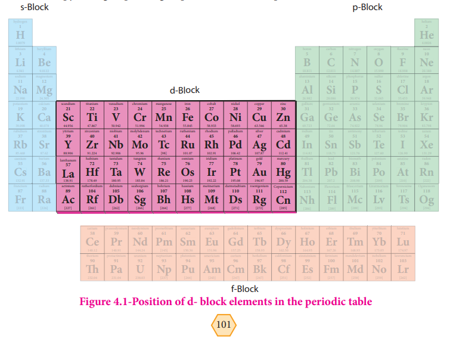

## Position of d- block elements in the periodic table:
 We have already learnt the periodic classification of elements in XI std. the transition

metals occupy from group –3 to group-12 of the modern periodic table.

nitrogen

14.007 **N**

**7**

helium

**He** 4.0026

**2**

neon

**Ne** 20.180

**10** uorine

**F** 18.998

**9** oxygen

**O** 15.999

**8** carbon

**C** 12.011

**6** boron

**B** 10.811

**5**

argon

**Ar** 39.948

**18** chlorine

**Cl** 35.453

**17** sulfur

**S** 32.065

**16** phosphorus

**P** 30.974

**15** silicon

**Si** 28.086

**14** aluminium

**Al** 26.982

**13**

krypton

**Kr** 83.798

**36** bromine

**Br** 79.904

**35** selenium

**Se** 78.96

**34** arsenic

**As** 74.922

**33** germanium

**Ge** 72.64

**32** gallium

**Ga** 69.723

**31** zinc

**Zn** 65.38

**30** copper

**Cu** 63.546

**29** nickel

**Ni** 58.693

**28** cobalt

**Co** 58.933

**27** iron

**Fe** 55.845

**26** manganese

**Mn** 54.938

**25** chromium

**Cr** 51.996

**24** vanadium

**V** 50.942

**23** titanium

**Ti** 47.867

**22** scandium

**Sc** 44.956

**21** calcium

**Ca** 40.078

**20** potassium

**K** 39.098

**19**

magnesium

**Mg** 24.305

**12** sodium

**Na** 22.990

**11**

beryllium

**Be** 9.0122

**4** lithium

**Li** 6.941

**3**

hydrogen

**H** 1.0079

**1**

xenon

**Xe** 131.29

**54** iodine

**I** 126.90

**53** tellurium

**Te** 127.60

**52** antimony

**Sb** 121.76

**51** tin

**Sn** 118.71

**50** indium

**In** 114.82

**49** cadmium

**Cd** 112.41

**48** silver

**Ag** 107.87

**47** palladium

**Pd** 106.42

**46** rhodium

**Rh** 102.91

**45** ruthenium

**Ru** 101.07

**44** technetium

**Tc** \[98\]

**43** molybdenum

**Mo** 95.96

**42** niobium

**Nb** 92.906

**41** zirconium

**Zr** 91.224

**40** yttrium

**Y** 88.906

**39** strontium

**Sr** 87.62

**38** rubidium

**Rb** 85.468

**37**

radon

**Rn** \[222\]

**86** astatine

**At** \[210\]

**85** polonium

**Po** \[209\]

**84** bismuth

**Bi** 208.98

**83** lead

**Pb** 207.2

**82**

dysprosium

**Dy** 162.50

**66** terbium

**Tb** 158.93

**65** gadolinium

**Gd** 157.25

**64** europium

**Eu** 151.96

**63** samarium

**Sm** 150.36

**62** promethium

**Pm** \[145\]

**61** neodymium

**Nd** 144.24

**60** praseodymium

**Pr** 140.91

**59** cerium

**Ce** 140.12

**58**

lanthanum

**La** 138.91

**57** barium

**Ba** 137.33

**56** caesium

**Cs** 132.91

**55**

roentgenium

**Rg** \[272\]

**111** Copernicium

**Cn** \[285\]

**112** Nahonium

**Nh** \[286\]

**113** Flerovium

**Fl** \[289\]

**114** Mascovium

**Mc** \[289\]

**115** Livermorium

**Lv** \[293\]

**116** Tennessine

**Ts** \[294\]

**117** Oganessom

**Og** \[294\]

**118** darmstadtium

**Ds** \[271\]

**110** meitnerium

**Mt** \[268\]

**109** hassium

**Hs** \[277\]

**108** bohrium

**Bh** \[264\]

**107** seaborgium

**Sg** \[266\]

**106** dubnium

**Db** \[262\]

**105** rutherfordium

**Rf** \[261\]

**104** radium

**Ra** \[226\]

**88** francium

**Fr** \[223\]

**87**

lutetium

**Lu** 174.97

**71** ytterbium

**Yb** 173.05

**70** thulium

**Tm** 168.93

**69** erbium

**Er** 167.26

**68** holmium

**Ho** 164.93

**67**

thallium

**Tl** 204.38

**81** mercury

**Hg** 200.59

**80** gold

**Au** 196.97

**79** platinum

**Pt** 195.08

**78** iridium

**Ir** 192.22

**77** osmium

**Os** 190.23

**76** rhenium

**Re** 186.21

**75** tungsten

**W** 183.84

**74** tantalum

**Ta** 180.95

**73** hafnium

**Hf** 178.49

**72**

berkelium

**Bk** \[247\]

**97** lawrencium

**Lr** \[262\]

**103** nobelium

**No** \[259\]

**102** mendelevium

**Md** \[258\]

**101** fermium

**Fm** \[257\]

**100** einsteinium

**Es** \[252\]

**99** californium

**Cf** \[251\]

**98** curium

**Cm** \[247\]

**96** americium

**Am** \[243\]

**95** plutonium

**Pu** \[244\]

**94** neptunium

**Np** \[237\]

**93** uranium

**U** 238.03

**92** protactinium

**Pa** 231.04

**91** thorium

 232.04

**90**

actinium

**Ac** \[227\]

**89**

s-Block

d-Block

p-Block

f-Block **Figure 4.1-Position of d- block elements in the periodic table**

XII U4-D-Block-Jerald Folder.indd 101 2/19/2020 4:40:17 PM

| L BN MC d-Block6.94 9.012 10.81 12.011 14.00sod1ium magnesium1 aluminium silico phosphorus22.99 24.30pota1ssium calci2 um scandium titanium vanadium chromium manganese iron cobalt nickel copper zinc39.09 40.07rubidium strontium |N9 115.99 18.99 20.18sulfur chlorin argon |
|------|------|------|------|------|------|------|------|------|------|------|------|------|------|------|------|------|
| A126.98gallium |S P14 128.08 30.97germanium arsenic |132.06selenium |Cl Ar1 135.45 39.94bromin krypto |
| Sc Ti V Cr Mn Fe Co Ni Cu ZnY Zr Nb Mo Tc Ru Rh Pd Ag CdLa21 Hf22 Ta23 W24 Re25 Os26 Ir27 Pt28 Au29 Hg3044.956 47.867 50.942 51.996 54.938 55.845 58.933 58.693 63.546 65.38Acyttr39ium zirRfco40nium Dbnio41bium molySg42bdenum teBhchne43tium ruHstheni44 um Mtrhod45ium palladiDs46um Rgsilver47 Cncadmi48um88.906 91.224 92.906 95.96 [98] 101.07 102.91 106.42 107.87 112.41lant57hanum hafn 72ium tant 73alum tungsten74 rhenium75 osmi76um irid77ium plat 78inum gold79 merc80ury138.91 178.49 180.95 183.84 186.21 190.23 192.22 195.08 196.97 200.59actinium89 ruther 104fordium dubn105ium seab 106orgium bo107hrium hassium108 meitnerium109 darm 110stadtium roen 111tgenium Copernici112 um[227] [261] [262] [266] [264] [277] [268] [271] [272] [285] |G369.72indium |G372.6ti |As S Br3 34 374.92 78.9 79.90antimony tellurium iodin |Kr383.79xeno |
| Rb Sr3 385.46 87.6caesium bariu |In49114.82thallium |Sn5118.71lead |S5121.7bismut |T5127.6polonium |5126.90astatine |X54131.2rado |
| C5132.91francium |B5137.3radium |T81204.3Nahoniu |P B Po A82 8 84 8207.2 208.98 [209 [210Flerovium Mascovium Livermorium Tennessine |Rn8[222Oganessom |
| Fr8[223 |R8[226 |
| N113[286] |F114[289] |Mc11[289 |L11[293 |Ts11[294 |Og11[294 |

| Pr N P Sm EPa U Np59 60 61 62 6140.91 144.24 [145] 150.3 151.96protactiniu91 urani92um neptunium9 plutonium americiu231.04 238.03 [237] |G T Dy6 6 6157.2 158.93 162.5curium berkelium californiu |
|------|------|------|------|------|------|------|------|------|------|
| H Er T6 68 69164.93 167.2 168.93einsteiniu fermium mendeleviu |Y70173.0nobelium |
| P94[244] |Am95[243] |C B9 9[247] [247] |Cf Es98 99[251] [252] |F M No100 101 102[257] [258] [259] |

  

d- Block elements composed of 3d series (4th period) Scandium to Zinc ( 10 elements), 4d series ( 5th period) Yttrium to Cadmium ( 10 elements) and 5d series ( 6th period) Lanthanum, Haffinium to mercury. As we know that the group-12 elements Zinc, Cadmium and Mercury do not have partially filled d-orbital either in their elemental state or in their normal oxidation states. However they are treated as transition elements, because their properties are an extension of the properties of the respective transition elements. As per the IUPAC definition, the seventh period elements, starting from Ac, Rf to Cn also belong to transition metals. All of them are radioactive. Except Actinium; all the remaining elements are synthetically prepared and have very low half life periods.

